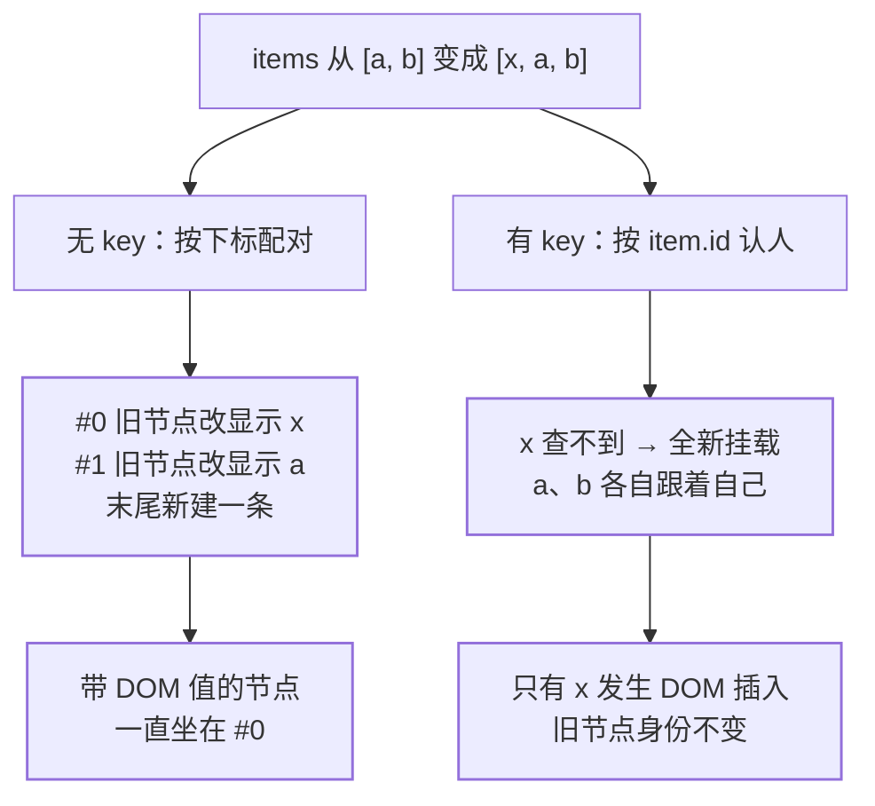
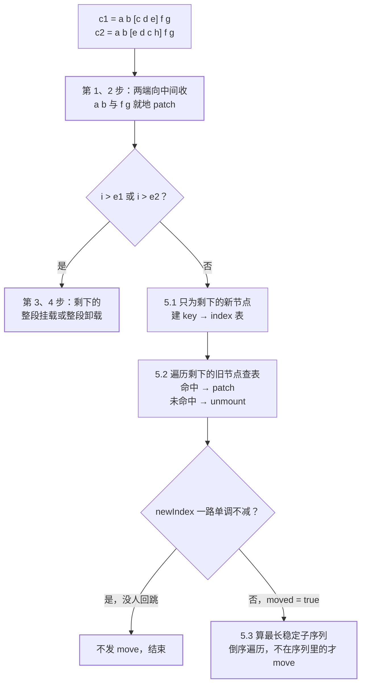

上一讲算的是「一次更新重做了多少工作」：谁跟着重渲染、diff 走多少节点、每个节点改什么
（见[一次更新到底重做了什么](/vue/intermediate/rendering/01-update-cost/)）。那三笔账
都默认了一件事——**比对的双方已经配好对了**。真实列表更新里最先要回答的是另一个问题：
新列表的第 3 行和旧列表的第几行是「同一行」？

这不是理论问题。列表里只要放一个输入框、一个勾选状态、一段动画，配对配错的表现不是
报错，而是**数据一条没丢、界面上串了行**。这一篇把「身份」这一层单独拆开：默认策略在
省什么、`key` 补的是什么、认完身份之后运行时怎么比、以及什么时候可以不写 `key`。

## 关卡一：默认策略是「就地更新」，它省的是移动

官方对 `v-for` 默认行为的描述在 API 页，一句话说完：

> "The default behavior of `v-for` will try to patch the elements in-place without
> moving them. To force it to reorder elements, you should provide an ordering hint
> with the `key` special attribute."
> —— 默认就地打补丁、不移动元素；要让它重排，得用 `key` 给一个排序提示。

指南页（「通过 key 管理状态」一节）把它说得更完整：数据项顺序改变时，Vue **不会**随之
移动 DOM 元素的顺序，而是就地更新每个元素，「确保它们在原本指定的索引位置上渲染」。

实现层能看出这条策略省在哪。无 key 的列表走 `renderer.ts` 里的 `patchUnkeyedChildren`，
去掉参数与克隆细节之后，函数体只剩三行逻辑：

```ts
const commonLength = Math.min(oldLength, newLength)
for (i = 0; i < commonLength; i++) {
  patch(c1[i], c2[i], container, null /* ... */)  // 按下标配对
}
if (oldLength > newLength) unmountChildren(c1, ..., commonLength)
else mountChildren(c2, container, anchor, ..., commonLength)
```

三个读点：

- **配对规则只有一条：下标相等。**`c1[i]` 配 `c2[i]`，不看内容、不看身份。
- **一次 DOM 移动都不会发生。**`move` 在这个函数里根本没出现；短的从尾巴补上，长的从
  尾巴卸掉。
- 于是「顺序变了」这件事在 DOM 层被翻译成「每个位置的**内容**都变了」。顺序变动越小、
  列表越长，这笔翻译越亏——但运行时不替你判断，它按默认策略走。

官方给这条策略划了边界，原文加粗的那句：**默认模式是高效的，但只适用于列表渲染输出的
结果不依赖子组件状态或者临时 DOM 状态（例如表单输入值）的情况**。「临时 DOM 状态」官方
括号里点名的就是输入框的值。把这句边界反过来读，就是最常见的翻车现场：

```vue-html
<!-- items 从 [a, b] 变成 [x, a, b]：x 是新增在头部的 -->
<li v-for="item in items">{{ item.text }}</li>
```

用户在第一个输入框里打了字（值只活在 DOM 里，没进任何状态），此刻 `unshift` 一条新数据。
按下标配对，旧的第 1 个 `<li>` 要开始显示 `x`、旧的第二个要显示 `a`——**每个位置的内容
都被重写一遍，而那个带着用户输入 DOM 值的一直原地不动**。结果：刚打的字出现在第二条上。

:::note[这一段是推导，不是官方原文]
官方只写了「就地更新每个元素，确保它们在原本指定的索引位置上渲染」和「不依赖……临时
DOM 状态」这两句。输入框的值留在原位置、于是错位到下一条，是把它们套到「下标配对」这个
实现上推出来的，属本篇推导。
:::

## 关卡二：key 买的是身份，不是性能

`key` 的定义在 API 页第一句，注意它把性能放在了次要位置：

> "The `key` special attribute is primarily used as a hint for Vue's virtual DOM
> algorithm to identify vnodes when diffing the new list of nodes against the old list."
> —— 它首先是给虚拟 DOM 算法的一个提示：比对新旧节点列表时用它**认出 vnode 是谁**。

也就是说 `key` 买的是**身份**，性能只是身份能换来的副产品。同一页把两个世界的行为差异
写成了对照：

| | 无 `key` | 有 `key` |
| --- | --- | --- |
| 算法目标 | 官方原话 *minimizes element movement*，尽量就地复用**同类型**元素 | 按 `key` 的顺序变化**重排**元素 |
| 消失的那一项 | 从尾巴截断（关卡一那三行） | *elements with keys that are no longer present will always be removed / destroyed* |

两行各自有实现对应：上面第一行就是 `patchUnkeyedChildren` 的按下标配对；第二行那句
「一定会被移除 / 销毁」在 `patchKeyedChildren` 里是 `newIndex === undefined` 那一支——
查表查不到的旧节点直接 `unmount`，不会被拖去配别人（关卡三展开）。



### key 的四条硬规矩

1. **同一个共同父节点下必须唯一。**官方原话 *Children of the same common parent must
   have **unique keys**. Duplicate keys will cause render errors.* 开发模式下运行时确实
   会警告，文案是 `Duplicate keys found during update: … Make sure keys are unique.`
2. **值要是标量。**指南页写「`key` 绑定的值期望是一个基础类型的值，例如字符串或 number
   类型」，并明确 *Do not use objects as `v-for` keys*；API 页的签名更宽，写
   `Expects: number | string | symbol`。两处并读：能定位身份的标量都行，对象不行。
3. **`<template v-for>` 上时 `key` 放在 `<template>` 容器上**，不是里面每个子元素。
4. 它是用 `v-bind` 绑定的**特殊 attribute**，别和「`v-for` 遍历对象」时那个第二个参数
   （对象的属性名，官方也叫它 key）混为一谈——官方专门为此写了一条 tip 提醒。

### key 的第二种用法：故意让它认不出来

同一页还有一句常被跳过：`key` *can also be used to force replacement of an element/
component instead of reusing it*，官方列了两个用途——正确触发组件的生命周期钩子、触发
过渡动画。例子是 `<transition>` 里包一个 `<span :key="text">`：`text` 一变，`<span>`
一定被替换而不是打补丁，于是过渡被触发。

机制在 `patch()` 开头那四行。新旧若不是「同一类同名」的节点，先卸掉旧的、再把 `n1` 置空，
之后完全按首次挂载走：

```ts
if (n1 && !isSameVNodeType(n1, n2)) {
  anchor = getNextHostNode(n1)
  unmount(n1, parentComponent, parentSuspense, true)
  n1 = null          // 之后走挂载分支：组件状态从零开始
}
```

而 `isSameVNodeType` 的判据只有两个字段：

```ts
return n1.type === n2.type && n1.key === n2.key
```

**类型和 key 一起比。**这解释了为什么「换 key」是重置子组件的官方手段：key 一变就不是
同一行了，组件实例整个重建、内部状态清零、钩子重跑。反过来也成立——用「给个随机 key」
强制刷新组件，代价是它下面整棵子树的状态一起丢掉。

### 那用 index 当 key 呢

当前 Vue 3 官方文档里**没有**一条针对「`index` 当 key」的条文（Vue 2 时代风格指南里的
那条已不在现在的风格指南页内，本篇不去引查不到的原文）。但把前面两句摆在一起就推得出来：

- 认身份的判据是 `type + key`；
- `v-for` 里第 i 项的 index 恒等于 i。

于是**在同一类元素组成的列表里，`:key="index"` 与「不写 key」给出的是同一套配对结果**：
身份退化成位置，也就退回关卡一那个「按位置翻译内容」的世界。差别只有一句：写下
`:key="index"` 的那一刻，你是在向读代码的人**声明「这一行的身份就是它的下标」**——
而列表业务里下标几乎从不等于身份。

:::note[标注]
上一段是全篇唯一的纯推导，依据是官方那两句（`isSameVNodeType` 的两个字段 + 就地更新的
定义）。它不是官方结论的转述，别在面试里说成「官方文档说 index 当 key 有 bug」。
:::

## 关卡三：认完身份之后，运行时到底怎么比

带 key 的列表由编译期算好的更新类型标记分派进来：`patchChildren` 一先看 `patchFlag`，
命中带 key 的片段走 `patchKeyedChildren`，命中 `UNKEYED_FRAGMENT` 走关卡一那个函数。
标记本身怎么生成见[一次更新到底重做了什么](/vue/intermediate/rendering/01-update-cost/)，
本篇只用到「两条路径是分开的」这一层。

`patchKeyedChildren` 的正文就是五段，源码注释自带编号：

```text
1. sync from start       头头比对，同类型同 key 就 patch，遇到不同就停
2. sync from end         尾尾比对，同上，从尾部往中间收
3. common sequence + mount    旧的先耗尽 → 剩下的全是新增，按锚点挂
4. common sequence + unmount  新的先耗尽 → 剩下的旧节点全卸
5. unknown sequence      中间这一段才真的需要「认人」
```

前四段是**不查表的快路径**：列表最常见的变化是头尾追加与删除，两端一收就消化掉了。花钱
的是第 5 段，它自己又分三步：



第三步里两个变量决定了这笔账的形状：

```ts
// 5.2 遍历剩余旧节点：无 key 的旧节点退化成线性找同类型的新节点
newIndex = keyToNewIndexMap.get(prevChild.key)
if (newIndex === undefined) unmount(prevChild)   // 官方那句「一定会被移除」
else {
  newIndexToOldIndexMap[newIndex - s2] = i + 1   // 0  reserved：没有对应旧节点
  if (newIndex >= maxNewIndexSoFar) maxNewIndexSoFar = newIndex
  else moved = true                              // 只有回跳过才置真
}
// 5.3 注释原话：generate longest stable subsequence only when nodes have moved
const seq = moved ? getSequence(newIndexToOldIndexMap) : EMPTY_ARR
```

- **表只覆盖中间那一段**（`s2..e2`），不是整个新列表——头尾已被前四段消化。
- **`moved` 是个开关**：一路走下来新下标单调不减，说明没人往回跳，第 5.3 段连最长稳定
  子序列都不算，`move` 一次也不发。**只有真乱序了才付这笔钱。**
- 5.3 倒序遍历、拿「后一个已处理节点」当锚点；不在稳定子序列里的节点才
  `move(..., MoveType.REORDER)`。**保持不动的那一批，正是最长稳定子序列。**

所以「Vue 的 key 让 diff 更快」这句要说全：key 把**中间段**的配对从「按下标硬猜」变成
「查表认人」，于是 DOM 移动被压到最少；代价是这一步要建一张表、乱序时再算一次子序列。
列表短、顺序基本只在尾部变化、又没有内部状态时，这笔买卖未必划算——这正是官方允许你
故意不写 key 的理由（关卡五）。

:::caution[读源码的边界]
上面三段读的是 `packages/runtime-core/src/renderer.ts` 当前实现（本篇按仓库 main 分支
现读）的**形状**，不是官方承诺的接口：变量名、分支顺序、是否用子序列算法都可能随版本变。
要复核就在该文件里搜注释 `5.1 build key:index map`。行为层面的承诺只看 API 页那两句
（按 key 重排 / 消失的 key 一定销毁）——那才是能写进设计文档的依据。
:::

## 关卡四：v-for 与 v-if 同时出现，谁先跑

官方口径在两处，结论一致：**`v-if` 比 `v-for` 的优先级更高**（指南原话）。后果不是性能
问题，而是**根本跑不通**——`v-if` 先求值，那时 `v-for` 的别名还不存在：

```vue-html
<!-- 官方注释：这会抛出一个错误，因为属性 todo 此时没有在该实例上定义 -->
<li v-for="todo in todos" v-if="!todo.isComplete">
  {{ todo.name }}
</li>
```

风格指南把这条列为**必须遵守**（Essential）级规则，措辞是 *Never use `v-if` on the same
element as `v-for`.*，理由写的是「二者的优先级不明显」。

官方列了两类常见动机，各给一条对策：

| 你想干什么 | 不要这样写 | 官方对策 |
| --- | --- | --- |
| 过滤列表中的项目 | `v-for="user in users" v-if="user.isActive"` | 换一个返回过滤结果的 computed（如 `activeUsers`） |
| 整张表该隐藏就别渲染 | `v-for="user in users" v-if="shouldShowUsers"` | 把 `v-if` 移到容器元素（`ul`、`ol`）上 |

指南里还有第三条同类出口：外层包 `<template v-for>`、把 `v-if` 放到里面的元素上。这不
算「同一节点上同时用两个指令」，优先级冲突自然消失，官方补了一句「这也更加明显易读」。

两条对策的落点是同一件事：**要渲染的是「过滤后的列表」这个东西，而不是「原列表 + 每行
自己决定在不在」**。这正是[该存、该算，还是跟着变化做一件事](/vue/intermediate/state/02-store-compute-or-react/)
关卡一那条分界——派生值该算出来，不该在做的事里顺手判。本篇不替它算省了多少次创建。

## 关卡五：数据侧的三件事，以及什么时候故意不写 key

### 改数组与换数组，触发更新的方式不同

官方列出的**变更方法**（会改原数组、Vue 能侦听到）七个：`push()`、`pop()`、`shift()`、
`unshift()`、`splice()`、`sort()`、`reverse()`。而 `filter()`、`concat()`、`slice()`
这类不可变方法**返回新数组**，不改原数组，所以要显式替换：

```js
// items 是一个数组的 ref
items.value = items.value.filter((item) => item.message.match(/Foo/))
```

官方紧接着堵住了一个直觉误解：「你可能认为这将导致 Vue 丢弃现有的 DOM 并重新渲染整个
列表——幸运的是，情况并非如此。Vue 实现了一些巧妙的方法来最大化对 DOM 元素的重用，因此
用另一个包含部分重叠对象的数组来做替换，仍会是一种非常高效的操作。」这句「巧妙的方法」
说的就是关卡三：只要 key 认得出人，换整个数组等于一次带 key 的子节点比对，DOM 不重建。

### 过滤与排序不要污染原始数据

要显示过滤/排序后的内容而不变更原数据，官方给的是**计算属性**：

```js
const numbers = ref([1, 2, 3, 4, 5])
const evenNumbers = computed(() => numbers.value.filter((n) => n % 2 === 0))
```

多层嵌套 `v-for` 里 computed 不可行时，官方给的替代是一个普通方法
`even(numbers)`，在模板里 `v-for="n in even(numbers)"`。同时官方专门警告：在计算属性里
用 `reverse()` 和 `sort()` 要务必小心，**这两个方法会变更原始数组**，计算函数里不该这么
做，先复制再调（官方那行 diff 是 `- numbers.reverse()` → `+ [...numbers].reverse()`）。
这与响应式那侧「getter 不应有副作用」是同一条纪律的两面，本篇不复述。

### 组件上的 v-for 不会自动把数据传进去

```vue-html
<MyComponent
  v-for="(item, index) in items"
  :item="item" :index="index" :key="item.id" />
```

直接在组件上用 `v-for` 跟在元素上用没区别（官方提醒：别忘记提供 key），但数据不会自动
流入。官方给的理由值得记住：自动注入 `item` 会让组件与 `v-for` 的工作方式紧密耦合，
**明确数据来源才能让组件在其他场景下可复用**。

### v-for 能遍历什么

| 源 | 别名写法 | 官方补充 |
| --- | --- | --- |
| 数组 | `(item, index)` | 最基本的一种 |
| 对象 | `(value, key, index)` | 遍历顺序基于对该对象调用 `Object.values()` 的返回值 |
| 整数 n | `n in 10` | 按 `1...n` 重复，**`n` 从 1 开始而不是 0** |
| 字符串 / 可迭代对象 | `(item, index)` | API 页：支持实现 Iterable 协议的值，含原生 `Map`、`Set` |

### 什么时候故意不写 key

官方那句推荐的完整形态是：推荐在**任何可行的时候**为 `v-for` 提供 key，**除非**所迭代的
DOM 内容非常简单（例如不包含组件或有状态的 DOM 元素），或者**你想有意采用默认行为来提高
性能**。

把两个「除非」拆开看，它们其实是同一个判断：这一列没有任何需要跨更新存活的身份。纯静态
文案列表、只从尾部追加的记录流都属于这一类——此时默认策略连一次 `move` 都不发（关卡一），
而写了 key 反而要多建一张表。编译期那侧也留了痕迹：无 key 的 `v-for` 子节点会被打上
`UNKEYED_FRAGMENT` 标记，走的就是关卡一那条快路径。

一句话判据：**不写 key 是「放弃身份换零移动」，是性能决策；写了 key 又用 index，是既
付了认人的钱、又没买到身份。**

## 一张表收尾：五种写法各买了什么

| 写法 | 身份从哪来 | 顺序变化时发生什么 | 什么时候用 |
| --- | --- | --- | --- |
| 不写 key | 位置 | 按下标就地改写内容，不移动 DOM | 无组件、无状态的简单列表；只从尾部增删 |
| `:key="item.id"` | 数据自带的稳定标识 | 认人重排，消失的 key 必被销毁 | 默认选择：会增删、会排序、行内有状态 |
| `:key="index"` | 位置（伪装成身份） | 与不写 key 同形，但要为认人付账 | 想不到该用什么时的反模式 |
| `<template v-for>` + `:key` | 数据自带的稳定标识 | 同上，key 挂在容器上 | 每次迭代要渲染多个平级元素 |
| 换 key 强制重建 | 你自己定义的那一行「一代」 | 组件实例整个重建、钩子重跑 | 切换账号/切表单要清干净状态 |

## 面试答法

- **「`v-for` 不加 key 会怎样？」** 不会报错。官方口径是默认走「就地更新」：数据顺序变了
  也不移动 DOM，只把每个索引位置的内容改到新数据上。所以纯展示的短列表完全没问题；一旦
  列表里有子组件状态或临时 DOM 状态（官方点名表单输入值），就会出现「数据没错、界面上
  串了行」——你打的那行字跑到邻居那里去了。
- **「那 key 到底是干什么的？」** 官方定义是虚拟 DOM 算法比对新旧节点时用来**认出 vnode
  身份**的提示。有 key 时按 key 的顺序变化重排元素，且 key 已不存在的元素一定被移除销毁；
  没有 key 时算法目标变成「最小化元素移动 + 尽量就地复用同类型元素」。
- **「key 要用什么值？」** 标量：字符串或数字（API 签名还允许 symbol），不要用对象。同一个
  父节点下必须唯一，重复会产生渲染错误，开发模式下会直接警告。
- **「用 index 当 key 为什么不好？」** 因为认身份的比较是 `type + key`，而 index 恒等于
  位置，等于把身份又换回了位置：中间插入或删除时，从那一位置起每一项都「换人」，带状态
  的行全部串位。它是「付了认人的成本却没买到身份」的组合。
- **「有 key 之后 diff 具体做了什么？」** 带 key 的子节点列表走双端向比对：先从两头收
  （头头、尾尾同类型同 key 就地 patch），收不动了才对中间这一段建新 key→index 表，逐个
  认人：查到就复用并 patch、查不到就卸载。最后只在「确实有节点往回跳过」时算一次最长
  稳定子序列，不在序列里的节点才真正移动 DOM。
- **「v-for 和 v-if 写在同一个元素上，Vue 3 里谁先？」** `v-if` 优先级更高，所以 `v-for`
  的别名在 `v-if` 里根本访问不到，官方明写这会抛错；风格指南把它列为必须遵守的规则。
  过滤要换成返回过滤结果的 computed，整表隐藏则把 `v-if` 移到 `ul` 这类容器上。
- **「重新赋值一个过滤后的数组，会不会整表重建？」** 官方明确说不会：Vue 用一套办法最大化
  复用 DOM 元素，用包含部分重叠对象的新数组替换旧数组仍是很高效的操作。前提是 key 认得出
  人——认不出来就只能按下标改写，那正是「看起来重建了」的成因。
- **「什么时候可以故意不写 key？」** 官方给了两个出口：迭代的 DOM 内容非常简单（不含组件
  或有状态 DOM 元素），或者有意采用默认行为来提高性能。判据是这一列有没有需要跨更新存活
  的身份，而不是「别人都写我也写」。

## 要点备忘

- `v-for` 默认是就地更新：不移动 DOM，只把每个索引位置改到新数据上
- 就地更新的适用边界由官方划定：不依赖子组件状态、不依赖临时 DOM 状态（表单输入值）
- 无 key 的配对规则只有一条——下标相等；这条路径上 `move` 一次也不会发生
- `key` 的定位是「认身份的提示」，性能是副产品，不是它本身
- 有 key 时按 key 顺序变化重排；key 已消失的元素一定被移除 / 销毁
- 同一父节点下 key 必须唯一，重复会渲染报错并触发开发模式警告
- key 要标量（string / number，API 签名含 symbol），不要用对象
- `<template v-for>` 的 key 写在 `<template>` 容器上，不是每个子元素上
- 认人的判据是 `type + key` 两个字段一起比
- 换 key = 组件实例重建：官方列的用途是触发生命周期钩子与过渡动画
- index 当 key 会把身份换回位置，与不写 key 同形，但仍要付认人的成本
- 带 key 的比对是双端向五步；前四步不查表，第 5 步才建 key→index 表
- 只有出现「新下标回跳」（moved）时才计算最长稳定子序列，不在序列里的节点才移动
- 变更方法七个：push / pop / shift / unshift / splice / sort / reverse
- filter / concat / slice 返回新数组，必须替换原数组；替换不等于重建列表
- 计算属性里别用 reverse() / sort()，它们改原数组；先 `[...numbers]` 再调
- 组件上的 `v-for` 不自动传数据，要显式写 props——为了让组件不绑死在 v-for 上
- `v-for="n in 10"` 的 `n` 从 1 开始；遍历对象按 `Object.values()` 的顺序
- 不写 key 是「放弃身份换零移动」的性能决策，不是省一行代码

## 延伸阅读

- [Vue 官方文档 · 列表渲染](https://cn.vuejs.org/guide/essentials/list.html)
  ——`v-for` 语法、对象与范围值、`v-if` 优先级、就地更新与 key、数组变更侦测
- [Vue 官方 API · key 特殊 attribute](https://vuejs.org/api/built-in-special-attributes.html#key)
  ——认身份的官方定义、无 key 与有 key 的行为对照、唯一性与强制替换
- [Vue 官方 API · v-for](https://vuejs.org/api/built-in-directives.html#v-for)
  ——默认就地更新那句、Iterable 支持
- [Vue 风格指南 · 必须遵守的规则](https://vuejs.org/style-guide/rules-essential.html)
  ——Use keyed `v-for` 与 Avoid `v-if` with `v-for` 两条
- 源码：`vuejs/core` 仓库 `packages/runtime-core/src/renderer.ts`
  ——`patchUnkeyedChildren`、`patchKeyedChildren`（注释自带 1~5 步编号）
- 站内互链：[一次更新到底重做了什么](/vue/intermediate/rendering/01-update-cost/)
  （更新类型标记与区块树：本篇的分派入口在那里算清）、
  [该存、该算，还是跟着变化做一件事](/vue/intermediate/state/02-store-compute-or-react/)
  （过滤后的列表是派生值，不是每行自己判在不在）、
  [输入框里的值什么时候才算数](/vue/basic/core/04-form-inputs/)
  （「临时 DOM 状态」最典型的那个值走哪条路）、
  [组件模型与单向数据流](/vue/basic/core/02-component-model/)
  （props 稳定性：列表行组件更新与否的另一半账）
