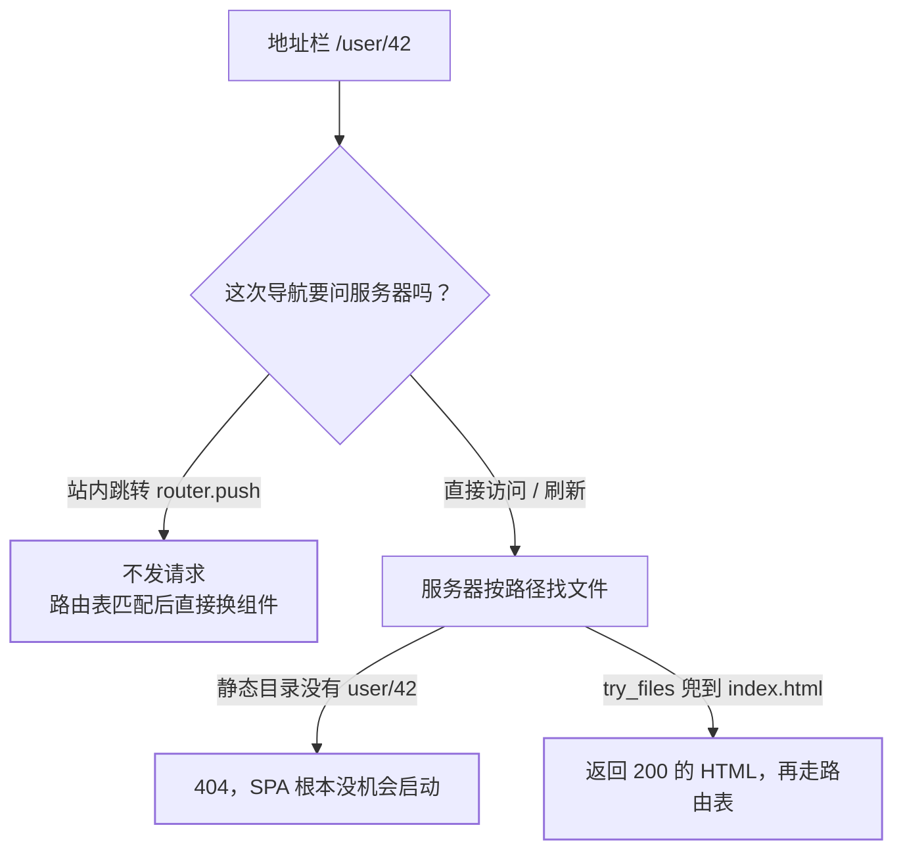
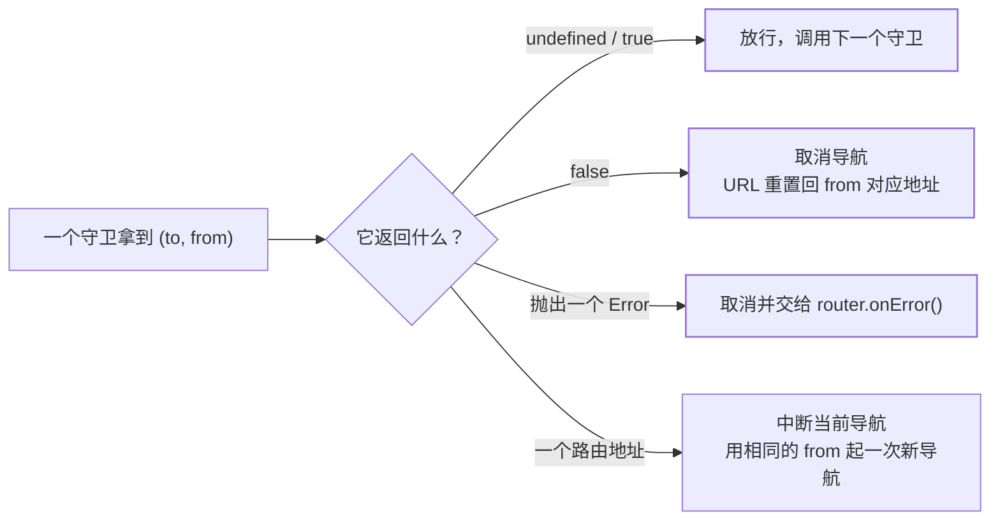

[响应式系统](/vue/basic/core/01-reactivity/)回答「改了数据谁会收到通知」，
[组件模型](/vue/basic/core/02-component-model/)回答「数据向下、事件向上怎么不失控」，
[状态放在哪一层](/vue/intermediate/state/01-where-to-put-state/)回答「多个组件共用的数据归谁
所有」。这一篇回答前端里最工程的一问：**浏览器地址栏里那串字符，是怎么变成你屏幕上
那个组件的**——以及中间哪一步会悄悄失败。

要先划清分工：`hashchange`、`history.pushState`、`popstate` 这三条浏览器机制本身，站内已经
写在[前端路由与 History API](/js/intermediate/web/07-route/)，本篇**不重讲机制**，只讲
Vue Router 在这套机制之上加的那层东西。原因是同一份路由代码有两条入口，走出的结果
并不一样：在应用**内部**点一下链接，浏览器根本不发请求；把地址复制给别人、或者直接按
刷新，请求就一定发给服务器。路由的坑几乎全部来自这条分界，所以下面按四道关卡来排：

1. **这次导航要不要问服务器**——历史模式与服务器兜底；
2. **哪条路由接走了它**——匹配语法、`matched` 与嵌套；
3. **该不该放行**——导航守卫、`meta` 与返回式写法；
4. **组件怎么拿到参数**——复用陷阱、`props` 解耦、缓存与分包。

每道关卡的失效点不同，混在一起背「路由守卫的执行顺序」是答不出第二问的。

## 关卡一：这次导航要不要问服务器

`history` 配置决定路由器怎么读写地址栏，官方给了三种：

| 模式 | 创建函数 | URL 形态 | 服务器要不要配 | 代价 |
| --- | --- | --- | --- | --- |
| Hash | `createWebHashHistory()` | `/#/user/42` | **不需要** | 官方明说「在 SEO 中确实有不好的影响」，`#` 被占用后不能当锚点用 |
| HTML5 | `createWebHistory()` | `/user/42` | **必须**回退到 `index.html` | URL 干净，官方写「推荐使用这个模式」 |
| Memory | `createMemoryHistory()` | 不碰 URL | 不涉及 | 「不会与 URL 交互也不会自动触发初始导航」，适合 Node 与 SSR；浏览器里用就没有前进/后退 |

```js
import { createRouter, createWebHistory } from 'vue-router'

const router = createRouter({
  history: createWebHistory(), // 官方推荐；hash 模式换成 createWebHashHistory()
  routes: [
    /* ... */
  ],
})
```

HTML5 模式的那句告诫是本页最该记住的：官方写「由于我们的应用是一个单页的客户端应用，
如果没有适当的服务器配置，用户在浏览器中直接访问 `https://example.com/user/id`，就会得到
一个 404 错误」。解法是在服务器上补一条回退——静态目录里找不到这个路径时，照样把
`index.html` 交出去：

```nginx
location / {
  try_files $uri $uri/ /index.html;
}
```

这条指令本身怎么工作（`try_files` 从左到右短路查找、兜底段是内部重定向），站内
[Nginx 的 rewrite、try_files 与文件解析](/nginx/basic/config/03-rewrite-try-files/)讲得更细，
这里只用它的结论：**兜底只对"前端路由的深链接"有效，对真正的静态资源同样会误伤**。



兜底会带来一个次生问题，官方在「附加说明」里点得很直白：「你的服务器将不再报告 404
错误，因为现在所有未找到的路径都会显示你的 index.html 文件」。于是 404 这件事从服务器
搬进了应用内部，得靠一条万能路由自己接住：

```js
// 官方 history-mode 页「附加说明」里的示例
const router = createRouter({
  history: createWebHistory(),
  routes: [{ path: '/:pathMatch(.*)', component: NotFoundComponent }],
})
```

> ⚠️ **官方两处写法不一致，别当成两种语法**：`history-mode` 页给的是
> `/:pathMatch(.*)`，而「捕获所有路由或 404 Not found 路由」那一节给的是
> `/:pathMatch(.*)*`，并解释「在这个特定的场景中，我们在括号之间使用了自定义正则表达式，
> 并将 `pathMatch` 参数标记为可选可重复」。本篇以带 `*` 的那条为准（它才是配套解释写全的
> 一处），但要判断自己项目里该写哪个，看装的那版 Vue Router 的行为，不要靠文档句子。

**这一关的失效边界**：本地 `pnpm dev` 一切正常，上线后深链接刷新全 404——因为 dev server
自带回退，而生产 Nginx 没配。这行配置就是那条分界线本身。

## 关卡二：哪条路由接走了它

路径参数的语法是一小组后缀修饰，官方那页（「路由的匹配语法」）把默认正则也写了：
`:userId` 内部用 `([^/]+)` 提取，即「至少一个不是斜杠的字符」。

| 写法 | 匹配 | 备注 |
| --- | --- | --- |
| `/users/:id` | `/users/42` | 多个参数按名字落进 `route.params` |
| `/:orderId(\\d+)` | `/25` | 自定义正则区分两条同为参数的路由 |
| `/:chapters+` / `/:chapters*` | `/one/two`、`/` | 可重复，拿到的是**数组** |
| `/:userId?` | `/users`、`/users/42` | 可选（0 或 1 个） |
| `/:pathMatch(.*)*` | 任意路径 | 万能路由，落进 `params.pathMatch` |

三条不那么显眼、但面试常被追问的默认行为：

- **数组顺序不决定优先级**。官方原句是「现在，转到 `/25` 将匹配 `/:orderId`，其他情况将会
  匹配 `/:productName`。**routes 数组的顺序并不重要!**」——匹配靠的是路径本身的写法与
  具体程度，不是谁先声明。排不出为什么没命中时，官方指了条路：用「路径排名工具」把路由
  转成正则看（该页「调试」一节）。
- **默认不区分大小写、也容忍尾斜杠**：`/users` 会匹配 `/users`、`/users/`、`/Users/`。要收紧
  就用路由上的 `sensitive`（区分大小写）和 `strict`（要求无尾斜杠），两者可全局也可单条。
- **嵌套路径以 `/` 开头就变成根路径**：官方写「注意，以 `/` 开头的嵌套路径将被视为根路径。
  这允许你利用组件嵌套，而不必使用嵌套的 URL」。

嵌套靠 `children` + 组件里再放一个 `<router-view />`。一个 URL 匹配成功后拿到的是**一串路由
记录**，官方定义是「一个路由匹配到的所有路由记录会暴露为 route 对象……的 `route.matched`
数组」，父记录在前、子记录在后。这决定了后面 `meta` 怎么读。

参数要出组件，官方推荐 `props`：「在你的组件中使用 `$route` 或 `useRoute()` 会与路由紧密
耦合，这限制了组件的灵活性，因为它只能用于特定的 URL」。三种模式按静态还是派生选：

```js
// 布尔模式：route.params 原样进 props
const routes = [{ path: '/user/:id', component: User, props: true }]

// 函数模式：把 query 转成 prop，顺带做类型转换
{ path: '/search', component: SearchUser, props: r => ({ query: r.query.q }) }
```

`props` 函数有一条官方告诫，很多人踩过才懂：「请尽可能保持 props 函数为无状态的，因为它
只会在路由发生变化时起作用。如果你需要状态来定义 props，请使用包装组件」。

## 关卡三：该不该放行——导航守卫

守卫的挂载点有三层，组合式 API 下每层都有对应写法：

| 挂载点 | 全局 | 单条路由 | 组件内（Options API） | 组件内（`<script setup>`） |
| --- | --- | --- | --- | --- |
| 前置 | `beforeEach` | `beforeEnter` | `beforeRouteEnter` | 无对应函数，用全局 |
| 更新 | — | — | `beforeRouteUpdate` | `onBeforeRouteUpdate` |
| 离开 | — | — | `beforeRouteLeave` | `onBeforeRouteLeave` |
| 收尾 | `beforeResolve`、`afterEach` | — | — | — |

官方给了一次导航的**完整解析流程**，逐条照抄（这是「守卫执行顺序」那道题的标准答案）：

1. 导航被触发。
2. 在失活的组件里调用 `beforeRouteLeave` 守卫。
3. 调用全局的 `beforeEach` 守卫。
4. 在重用的组件里调用 `beforeRouteUpdate` 守卫(2.2+)。
5. 在路由配置里调用 `beforeEnter`。
6. 解析异步路由组件。
7. 在被激活的组件里调用 `beforeRouteEnter`。
8. 调用全局的 `beforeResolve` 守卫(2.5+)。
9. 导航被确认。
10. 调用全局的 `afterEach` 钩子。
11. 触发 DOM 更新。
12. 调用 `beforeRouteEnter` 守卫中传给 `next` 的回调函数，创建好的组件实例会作为回调
    函数的参数传入。

顺序之外有两句更要紧的：「全局前置守卫**按照创建顺序**调用。守卫是异步解析执行，此时
导航在所有守卫 resolve 完之前一直处于等待中」——所以注册了三个 `beforeEach` 就是三道闸，
任何一道卡住，整跳就挂着。而 `afterEach` 恰恰相反，官方明说它「不会接受 `next` 函数也不会
改变导航本身」，用它埋点可以，用它拦权限是拦不住的。

守卫怎么给结论，这一版文档的答案是**返回**，不是调 `next`：

```js
router.beforeEach(async (to) => {
  if (to.meta.requiresAuth && !auth.isLoggedIn()) {
    return { name: 'Login', query: { redirect: to.fullPath } }
  }
})
```



`next` 并没有消失，但官方的措辞很重：「在之前的 Vue Router 版本中，还可以使用 _第三个
参数_ `next`。**这是一个常见的错误来源**，我们经过 RFC 讨论将其移除。然而，它仍然是被
支持的」，且要求「确保 `next` 在任何给定的导航守卫中都被**严格调用一次**」。官方紧接着
给的错误用例，就是把登录校验写成「不通过就 `next({name:'Login'})`，然后无条件再
`next()`」——两次调用，钩子永不 resolve。

**权限那条线怎么落**。`meta` 是给路由挂任意信息的口子（官方例：「过渡名称、谁可以访问
路由」）。因为一次匹配是一串记录，逐条检查是这样：

```js
// 嵌套 meta 的两种读法
to.matched.some(record => record.meta.requiresAuth)
to.meta.requiresAuth // 官方：非递归合并所有 meta 字段（从父字段到子字段）
```

合并语义意味着子记录可以覆盖父记录，所以上面的登录判断只写一次就够。被拦下去的跳要
把原地址带上，登录后回跳——`query: { redirect: to.fullPath }` 那句就是干这个的。另有一条
省事的：官方写「从 Vue 3.3 开始，你可以在导航守卫内使用 `inject()` 方法」，`app.provide()`
提供的内容（含 Pinia store）能在 `beforeEach`/`beforeResolve`/`afterEach` 里拿到，不必把
store 绕进守卫的参数里。

## 关卡四：动态权限路由、复用陷阱与分包

**登录后才知道有哪些菜单**，是最常见的动态路由场景，靠 `addRoute()` / `removeRoute()`。
这一处有个必踩的坑，官方说得非常明确：「它们只注册一个新的路由，也就是说，如果新增加的
路由与当前位置相匹配，就需要你用 `router.push()` 或 `router.replace()` 来手动导航，才能显示
该新路由」。

```js
router.addRoute({ path: '/about', name: 'about', component: About })
// 只注册不导航：页面仍停在旧组件上
router.replace(router.currentRoute.value.fullPath) // 需要 await 就等它
```

如果加路由这个动作本身就写在守卫里，结论要换成返回地址而不是调 `replace()`，官方的
示例是这样：

```js
router.beforeEach(to => {
  if (!hasNecessaryRoute(to)) {
    router.addRoute(generateRoute(to))
    return to.fullPath // 触发重定向，而不是调 router.replace()
  }
})
```

配套还有三条：删除可以①用同名 `addRoute`（同名会先删后加）、②用 `addRoute()` 返回的回调
`removeRoute()`、③用 `router.removeRoute(name)`；官方补了一句「当路由被删除时，所有的别名
和子路由也会被同时删除」。名字不想冲突时，「可以在路由中使用 Symbol 作为名字」。想读
现状则用 `router.hasRoute()` 与 `router.getRoutes()`。

**同一路由换参数，组件不会重新初始化**。官方的三句是连着的：「当用户从 /users/johnny
导航到 /users/jolyne 时，相同的组件实例将被重复使用」「因为两个路由都渲染同个组件，比起
销毁再创建，复用则显得更加高效」「不过，这也意味着组件的生命周期钩子不会被调用」。
于是「进了详情页数据还是上一个用户的」就有了成因。解法官方给两条：

```js
import { useRoute } from 'vue-router'
const route = useRoute()
// 只监听会变的那一项：官方强调「应该避免监听整个 route 对象」
watch(() => route.params.id, id => fetchUser(id))
```

```vue
<script setup>
import { onBeforeRouteUpdate } from 'vue-router'
onBeforeRouteUpdate(async to => {
  userData.value = await fetchUser(to.params.id)
}) // 它比 watch 多一个能力：可以返回 false 取消这一跳
</script>
```

**缓存与分包**是路由层的两件工程账。缓存要 `keep-alive`，但包的对象有讲究——官方原话：
「当在处理 KeepAlive 组件时，我们通常想要保持路由组件活跃，而不是 RouterView 本身」，
所以要走 `RouterView` 插槽：

```vue
<router-view v-slot="{ Component }">
  <keep-alive>
    <component :is="Component" />
  </keep-alive>
</router-view>
```

同一个插槽也解释了为什么 `ref` 要放在 `<component>` 上：「而如果我们将引用放在
`<router-view>` 上，那引用将会被 RouterView 的实例填充，而不是路由组件本身」。

分包侧，路由懒加载就是把 `component` 换成返回 Promise 的函数：

```js
const UserDetails = () => import('./views/UserDetails.vue')
```

官方两句配套：「Vue Router 只会在第一次进入页面时才会获取这个函数，然后使用缓存数据」，
以及一条注意——「**不要在路由中使用异步组件**。异步组件仍然可以在路由组件中使用，但路由
组件本身就是动态导入的」。想把多条路由并进同一个 chunk，webpack 用注释命名
（`import(/* webpackChunkName: "group-user" */ './UserDetails.vue')`），Vite 侧官方给的是
`build.rollupOptions.output.manualChunks`。

## 面试答法

- **「history 模式和 hash 模式选哪个，代价是什么？」** 先答分界：hash 的 `#` 之后那段
  「从未被发送到服务器，所以它不需要在服务器层面上进行任何特殊处理」，代价是官方明写的
  SEO 负面影响和锚点被占用；history 是官方推荐，URL 干净，代价是必须配服务器回退，
  且回退之后「服务器将不再报告 404」，得自己在应用里放一条万能路由。
- **「为什么本地好好的，上线刷新就 404？」** dev server 自带回退，生产 Nginx 没有。一行
  `try_files $uri $uri/ /index.html;` 就是那条分界线的落地。
- **「Vue Router 的守卫执行顺序？」** 报那 12 步，但一定要补两句：全局 `beforeEach` 之间
  按注册顺序、且导航会等所有守卫 resolve；`afterEach` 改不了导航，权限判断不能放它。
- **「守卫里怎么取消/跳转？」** 返回式：`false` 取消（URL 会重置回 `from`）、返回一个路由
  地址就是重定向（中断当前导航、用相同 `from` 起新导航）、抛 `Error` 交给
  `router.onError()`。`next` 仍被支持，但官方称它是「常见的错误来源」，用就必须严格一次。
- **「`/user/1` 跳到 `/user/2` 数据不刷新，为什么？」** 同组件被复用、生命周期钩子不会调用；
  改用 `watch(() => route.params.id, ...)` 或 `onBeforeRouteUpdate`，后者还能取消导航。
- **「动态权限路由要注意什么？」** `addRoute()` 只注册不导航，当前位置若匹配到新路由必须手动
  `push`/`replace`；写在守卫里就改成 `return to.fullPath`。
- **「路由懒加载和 `defineAsyncComponent` 有什么区别？」** 官方明确「不要在路由中使用异步
  组件」，路由组件本身就该是动态导入；异步组件用在路由组件**内部**。

## 要点备忘

- 路由的所有坑几乎都能回到一条分界：**站内跳转不发请求，直接访问/刷新一定发请求**
- 三种历史模式：`createWebHashHistory()`（免服务器配置、SEO 差）、`createWebHistory()`
  （推荐、必须配回退）、`createMemoryHistory()`（不碰 URL，给 Node 与 SSR，且要手动
  push 初始导航）
- 兜底后 404 从服务器搬进应用：配一条 `/:pathMatch(.*)*` 的万能路由；官方两处示例
  写法不一致，以带 `*` 且解释完整的那处为准
- 匹配语法：`:id`、`(\\d+)` 自定义正则、`+`/`*` 可重复（拿到数组）、`?` 可选；
  默认不区分大小写、容忍尾斜杠，靠 `sensitive` / `strict` 收紧
- **`routes` 数组顺序不决定优先级**（官方原话「routes 数组的顺序并不重要!」）；
  匹配串不出来时用官方的路径排名工具
- 嵌套：`children` + 组件内再放 `<router-view />`；子路径以 `/` 开头即视为根路径；
  一次匹配是一串记录，读法有 `route.matched` 与合并后的 `route.meta`
- 组件想脱离 URL：`props: true`（参数进 props）/ 对象（静态）/ 函数（派生），
  函数要保持无状态
- 导航解析 12 步；守卫返回 `false` / 路由地址 / `undefined` 或 `true` / 抛错，
  `next` 严格一次否则永不解析
- 登录拦截正解：`meta.requiresAuth` + `return { name: 'Login', query: { redirect:
  to.fullPath } }`；守卫内可用 `inject()` 拿 Pinia（Vue 3.3+）
- `addRoute()` 只注册不导航；删除三种方式，删父路由会连带别名与子路由
- 同组件换参数不重跑生命周期 → `watch` 单个参数或 `onBeforeRouteUpdate`；
  `keep-alive` 要包 `<component :is="Component" />`，`ref` 放 `<component>` 不放 `<router-view>`

## 延伸阅读

> 下列官方页均已实测可达（200）。中文页顶部标注「该翻译已同步到了 2024-05-17 的版本，
> 其对应的 commit hash 是 d842b6f」，句子以英文页复核更稳；官方文档另已收录「文件路由
> （file-based routing）」等新章节，本篇只覆盖手工传 `routes` 的传统用法，不据此断版本。

- [Vue Router 官方文档 · 不同的历史记录模式](https://router.vuejs.org/zh/guide/essentials/history-mode.html)
- [Vue Router 官方文档 · 动态路由匹配](https://router.vuejs.org/zh/guide/essentials/dynamic-matching.html)
- [Vue Router 官方文档 · 路由的匹配语法](https://router.vuejs.org/zh/guide/essentials/route-matching-syntax.html)
- [Vue Router 官方文档 · 嵌套路由](https://router.vuejs.org/zh/guide/essentials/nested-routes.html)
- [Vue Router 官方文档 · 路由组件传参](https://router.vuejs.org/zh/guide/essentials/passing-props.html)
- [Vue Router 官方文档 · 编程式导航](https://router.vuejs.org/zh/guide/essentials/navigation.html)
- [Vue Router 官方文档 · 导航守卫](https://router.vuejs.org/zh/guide/advanced/navigation-guards.html)
- [Vue Router 官方文档 · 路由元信息](https://router.vuejs.org/zh/guide/advanced/meta.html)
- [Vue Router 官方文档 · 动态路由](https://router.vuejs.org/zh/guide/advanced/dynamic-routing.html)
- [Vue Router 官方文档 · RouterView 插槽](https://router.vuejs.org/zh/guide/advanced/router-view-slot.html)
- [Vue Router 官方文档 · 路由懒加载](https://router.vuejs.org/zh/guide/advanced/lazy-loading.html)
- [Vue Router 官方文档 · Vue Router 和组合式 API](https://router.vuejs.org/zh/guide/advanced/composition-api.html)
- 站内配套：[前端路由与 History API](/js/intermediate/web/07-route/)（机制层）、
  [Nginx 的 rewrite、try_files 与文件解析](/nginx/basic/config/03-rewrite-try-files/)（兜底那条
  指令）、[状态放在哪一层](/vue/intermediate/state/01-where-to-put-state/)（哪些状态该进 URL）、
  [一次更新到底重做了什么](/vue/intermediate/rendering/01-update-cost/)（换组件的成本账）
