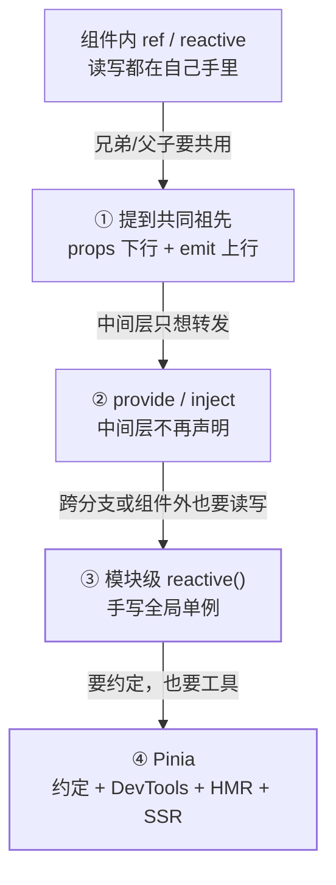
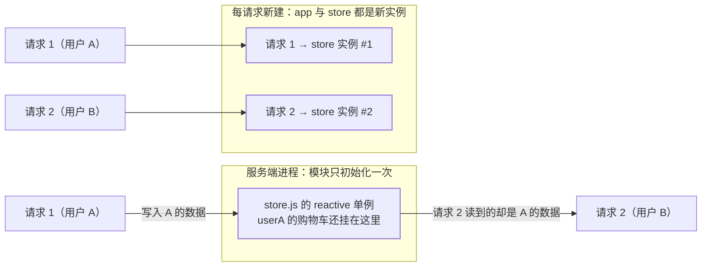

[响应式系统](/vue/basic/core/01-reactivity/)回答「改了数据谁会收到通知」，
[组件模型](/vue/basic/core/02-component-model/)回答「数据向下、事件向上怎么不失控」，
[一次更新重做了什么](/vue/intermediate/rendering/01-update-cost/)回答「通知之后要重跑多少
代码」。这一篇问的是最工程的那一半：**这份状态该放在哪一层**。放低了远处拿不到，
只能一层层往上抬；抬过头了，任何组件都能改它，再也不知道是谁改的。Vue 官方把这
条路写成了递进的几档，本篇按「可见范围」把它们排成四个台阶——每上一个台阶换来
一份自由，欠下一份代价，代价写在每一节的末尾。

React 侧的同题篇在
[状态管理与 Context](/react/intermediate/state/01-context-vs-store/)，两篇对照着读最省时间：
差别根源是 Vue 的响应式系统与组件模型解耦，所以「跨层送达」和「全局共享」这两级
的机制与 React 不同。

## 判据只有两条：谁能读、谁能改

官方状态管理页开篇把组件钉成一个自足的单位，下面三句是官方中文页原文：

> **状态**：驱动整个应用的数据源；
> **视图**：对**状态**的一种声明式映射；
> **交互**：状态根据用户在**视图**中的输入而作出相应变更的可能方式。

这就是「单向数据流」的全部——一个组件同时握着数据源和改它的方式，没有外部依赖，
也就不存在问题。官方接着给出的转折正是本篇的题眼（中文页原文）：

> 然而，当我们有**多个组件共享一个共同的状态**时，就没有这么简单了：
>
> 1. 多个视图可能都依赖于同一份状态。
> 2. 来自不同视图的交互也可能需要更改同一份状态。

两条各自有对应的坏味道，官方点名的第二种尤其直白：**直接通过模板引用获取父/子
实例**，或者**通过触发的事件尝试改变和同步多个状态的副本**——原文判词是「这些模式
的健壮性都不甚理想，很容易就会导致代码难以维护」。

选层只需要问两句话：

- **谁能读**：读它的组件在树上离写它的人多远？（决定要不要往上抬）
- **谁能改**：是不是只有一个持有者能改？（决定要不要引入约束）

台阶按「谁能读」的范围一路放宽，读到最远处（组件树之外也要读）就撞上 Pinia。

## 四个台阶总览



| 台阶 | 解决的 | 新欠下的 |
| --- | --- | --- |
| ① 状态提升 | 单一来源，数据仍有主人 | 中间层被迫声明并转发 props |
| ② provide / inject | 穿透任意深度的中间层 | 可见范围仍是一棵子树，纪律靠自觉 |
| ③ 模块级 `reactive()` | 组件树之外也能读写 | 谁都能改，SSR 下有跨请求风险 |
| ④ Pinia | 约定、时间轴、HMR、SSR 支持 | 多一个依赖与一套心智模型 |

## 台阶一：提到共同祖先，用 props 下行

官方给情景 1 的第一个办法就是这个：「一个可行的办法是将共享状态"提升"到共同的
祖先组件上去，再通过 props 传递下来」。它守得住单向数据流——数据的所有者仍是那个
祖先，子组件只读，要改就 emit 事件回去（见
[组件模型与单向数据流](/vue/basic/core/02-component-model/)）。

代价在树深的时候出现，官方给了名字：**Prop 逐级透传问题**，中文页的场景原文是：

> 想象一下这样的结构：有一些多层级嵌套的组件，形成了一棵巨大的组件树，而某个深层的
> 子组件需要一个较远的祖先组件中的部分数据。

英文页把同一场景说得非常具体（原文 + 中译）：

> *Notice although the `<Footer>` component may not care about these props at all,
> it still needs to declare and pass them along just so `<DeepChild>` can access
> them. If there is a longer parent chain, more components would be affected along
> the way.*
>
> 尽管 `<Footer>` 可能根本不关心这些 props，它仍要声明并一路传下去，只为让
> `<DeepChild>` 拿得到；链路越长，被牵连的组件就越多。

还有一笔与更新成本挂钩的账，是这一层最容易被忽略的：祖先的状态一变，链路上每个
声明并转发这份 props 的组件都会收到**变化后的值**，于是它们各自都要重渲染一次——
哪怕 `<Footer>` 只是转发、根本不读它。判断闸门正是
[一次更新重做了什么](/vue/intermediate/rendering/01-update-cost/)里那条
「子组件只在收到的某个 prop 变化时才更新」。所以抬升不是免费的：**抬得越高、
转发链越长，被牵进来的无关组件就越多**。

**适用边界**：读它的人都在同一棵子树里、层级不深、而且写的人就是那个祖先。
三条满足就别往上走。

## 台阶二：provide / inject 换的是路径，不是所有权

官方对这一级的定位是**依赖注入**：

> 一个父组件相对于其所有的后代组件，会作为**依赖提供者**。任何后代的组件树，
> 无论层级有多深，都可以**注入**由父组件提供给整条链路的依赖。

注意它换掉的只是「传递路径」：中间层不再声明、不再转发，但状态的所有权还在
提供者那个实例上。由此带来三条硬规则，都是官方明写的。

**一、两个函数都必须在 `setup()` 里同步调用。**官方两处分别提醒（中文页原文）：
如果不使用 `<script setup>`，「请确保 `provide()` 是在 `setup()` 同步调用的」，
`inject()` 同样「需要在 `setup()` 内同步调用」。按机制解释一句：注入名是沿**当前
组件实例的父链**向上查找的，`await` 之后再调用时已经没有这个上下文，自然拿不到
提供者——这一句是本篇补的因果，官方只给规则。

**二、变更最好留在供给方。**官方建议：

> 当提供 / 注入响应式的数据时，**建议尽可能将任何对响应式状态的变更都保持在
> 供给方组件中**。这样可以确保所提供状态的声明和变更操作都内聚在同一个组件内，
> 使其更容易维护。

真需要注入方来改，官方给的正解不是「把 state 一起发下去」，而是**提供一个负责
更改数据的方法函数**：

```vue
<!-- 供给方组件内 -->
<script setup>
import { provide, ref } from 'vue';

const location = ref('North Pole');

function updateLocation() {
  location.value = 'South Pole';
}

provide('location', { location, updateLocation });
</script>
```

```vue
<!-- 注入方组件内：只调方法，不碰值 -->
<script setup>
import { inject } from 'vue';

const { location, updateLocation } = inject('location');
</script>

<template>
  <button @click="updateLocation">{{ location }}</button>
</template>
```

想更硬一点，官方还给了兜底，中文页原句是：「如果你想确保提供的数据不能被注入方的
组件更改，你可以使用 `readonly()` 来包装提供的值。」

**三、响应性是「提供侧」建立的，不是注入侧。**provide 一个 ref 就够——官方原句是
*Providing reactive values allows the descendant components using the provided
value to establish a reactive connection to the provider component.*（提供响应式的
值，能让用到它的后代组件与提供者建立响应式连接）。但 Options API 的 `provide`
对象语法有坑，官方明写：把值写在 `provide` 对象里「**does not** make the
injection reactive」，需要显式提供 `computed(() => this.message)` 才连得上。

另有两条工程细节值得记：注入名找不到提供者会有运行时警告，所以可选依赖要写
默认值；默认值本身要现算时用工厂函数并传第三个参数（`inject('key', () => new
ExpensiveClass(), true)`）。应用大了或在做组件库，官方建议注入名用 `Symbol`
「以避免潜在的冲突」，并且把 Symbol 导在一个专门文件里。

**这一级最常被误用成"轻量全局状态"**：它管不到兄弟子树，也管不到组件之外，
提供者所在的组件一旦不在链路上，注入端就只剩默认值。它解决的是「透传」，
不是「共享」——真正的全局共享在下一台阶。

## 台阶三：模块级 reactive()，一个手写的全局单例

官方给出的「更简单直接的解法」是把共享状态从组件里抽出来，放进一个全局单例
（原文）：

> A simpler and more straightforward solution is to extract the shared state out
> of the components, and manage it in a global singleton. With this, our component
> tree becomes a big "view", and any component can access the state or trigger
> actions, no matter where they are in the tree!

落到代码就是一整个文件：

```js
// store.js
import { reactive } from 'vue';

export const store = reactive({
  count: 0,
  increment() {
    this.count++;
  },
});
```

任何组件 `import { store }` 后直接用。官方对它的评价分两面。正面（英文原文 + 中译）：

> *Now whenever the `store` object is mutated, both `<ComponentA>` and
> `<ComponentB>` will update their views automatically - we have a single source
> of truth now.*
>
> 只要 `store` 被改动，两个组件的视图都会自动更新——现在只有一个数据源了。

反面是官方中文页紧接的一句原文：**「然而，这也意味着任意一个导入了 `store` 的
组件都可以随意修改它的状态」**。

官方给的补救是把变更收进方法，并且方法名要表达意图（「为了确保改变状态的逻辑
像状态本身一样集中，建议在 store 上定义方法，方法的名称应该要能表达出行动的
意图」）。这里有个真实会踩的小坑，官方专门写了 TIP：模板里的点击处理函数要
写成 `store.increment()`，**带上圆括号**作为内联表达式调用，因为它不是组件的
方法，必须以正确的 `this` 上下文调用。

为什么一个模块级对象能跨组件工作？官方那句是根因：*The fact that Vue's
reactivity system is decoupled from the component model makes it extremely
flexible.*（响应式系统与组件模型解耦，使它极其灵活）。同一原理也支撑官方给出的
另一种写法——在模块作用域创建 `ref`，由组合式函数导出：module-scope 的是全局
状态，函数内部的才是每组件一份的局部状态（对照
[Composition API 与逻辑复用](/vue/basic/core/03-composition-api/)）。

**失效边界有两条，第二条最值钱。**

约定靠自觉：任意模块都能改，出了事既没有变更记录、也没有时间轴可回放——官方列给
Pinia 的那四条（协作约定、DevTools、HMR、SSR 支持）正是这一层缺的东西，团队一大
就没人说得清「这个字段是谁写的」。

**SSR 下它是跨请求共享的单例。**官方 SSR 注意事项原文：「如果你正在构建一个需要
利用服务端渲染 (SSR) 的应用，由于 store 是跨多个请求共享的单例，上述模式可能会导致
问题。」它指向的那一节把机理说得更狠：

> 同一个应用模块会在多个服务器请求之间被复用，而我们的单例状态对象也一样。如果
> 我们用单个用户特定的数据对共享的单例状态进行修改，那么这个状态可能会意外地
> 泄露给另一个用户的请求。推荐的解决方案是在每个请求中为整个应用创建一个全新的
> 实例。

也就是说，「把 `reactive()` 导出来当 store」在面试里最容易被追问穿的就是这一条：
它不是"写法不对"，而是**模块级单例在服务端进程里活得太久**。



上半张是官方警告的现场：状态泄露的方向是**跨请求**，不是跨组件——这也是为什么
纯客户端 SPA 里这种写法看起来完全正常。下半张是官方给的解法形状。

## 台阶四：Pinia 补的正是台阶三欠的那几条

官方在讲完手写方案后列了大规模应用要考虑的事项，逐条对上了上面的缺口：

> - 更强的团队协作约定
> - 与 Vue DevTools 集成，包括时间轴、组件内部审查和时间旅行调试
> - 模块热更新 (HMR)
> - 服务端渲染支持

并给出定位：「Pinia 就是一个实现了上述需求的状态管理库，由 Vue 核心团队维护」；
对上一代方案的说法也很明确——Vuex「现在处于维护模式」，「它仍然可以工作，但不再
接受新的功能。对于新的应用，建议使用 Pinia」。

**定义与创建时机**。官方中文页原句：「Store 是用 `defineStore()` 定义的，它的
第一个参数要求是一个**独一无二的**名字」。第二条同样重要：「在我们使用
`<script setup>` 调用 `useStore()`……之前，store 实例是不会被创建的」——定义只是
登记，用到才实例化，因此不用的 store 不进运行时。

**setup store 的三条规则**：官方英文页的两句是 *`ref()`s become `state` properties*
（`ref()` 成为 state 属性）、*`function()`s become `actions`*（函数成为 action）；
中文页另有一条硬要求——「注意，要让 pinia 正确识别 `state`，你**必须**在 setup store
中返回 **`state` 的所有属性**」；以及「不要返回像 `route` 或 `appProvided` 之类的属性，
因为它们不属于 store，而且你可以在组件中直接用 `useRoute()` 和
`inject('appProvided')` 访问」。

**getters 就是 computed**。官方原句：*Getters are just computed properties behind
the scenes, so it's not possible to pass any parameters to them.*（本质就是计算
属性，因此不能传参）。这意味着它按依赖缓存；但官方也标了一个反例——getter 写成
返回函数时「**getters are not cached anymore**」（不再被缓存）。

**最实用的一条：解构会丢响应性。**官方中文页对这段代码的判词是「❌ 下面这部分代码
不会生效，因为它的响应式被破坏」，正确写法紧跟其后：

```js
const store = useCounterStore();

// ❌ 解构 state：拿到的是快照，之后不再更新
const { count } = store;

// ✅ 取 state / getters 并保持响应性，用 storeToRefs()
const { doubleCount } = storeToRefs(store);

// ✅ 官方原句：名为 increment 的 action 可以被解构
const { increment } = store;
```

为什么会坏？按[响应式系统](/vue/basic/core/01-reactivity/)的 Proxy 口径解释就顺了：
store 是代理对象，只有 `store.count` 这一次属性访问才被代理记录为「读」；解构相当于
把值一次性抄出来，得到一个普通快照，之后代理上的变化与它无关。action 是函数，
解构只是换个名字引用同一个函数，所以安全（这一句因果是本篇按机制补的解释，官方
只给结论与原句）。

**还有两条边界**。第一条是「别整块换掉 state」，官方英文原句：*You **cannot exactly
replace** the state of a store as that would break reactivity.*（不能真正意义上的
替换 store 的 state，那会破坏响应性）。要批量改请用 `$patch`——*It allows you to
apply multiple changes at the same time*；要观察状态变化用 `$subscribe()`。

第二条是**组件之外用 store 要显式传实例**。路由守卫、服务端预取函数里调用
`useStore()` 时，官方要求 *pass the pinia instance that was passed to the app to the
`useStore()` function call*（把传给 app 的那个 pinia 实例交给 `useStore()` 调用）。
SSR 侧官方的说法是 *Creating stores with Pinia should work out of the box for SSR*，
而它成立的前提正是这一条加上**每请求一个 pinia 实例**——与台阶三那条 SSR 警告
是同一个道理。

**与 Vuex 的差异**要说到点上。官方 introduction 页的几条理由（英文原文 + 中译）：
*mutations no longer exist. They were often perceived as extremely verbose*（mutation
不复存在，它们过去常被认为极其冗余）；*No more nested structuring of modules*、
*No namespaced modules*——不再有嵌套模块与命名空间模块，store 天生扁平、天生自带
命名空间，一个 store 要用另一个就直接 import 进来调用；*No more magic strings to
inject, import the functions, enjoy autocompletion!*（不必再注入魔法字符串，直接
导入函数换自动补全）；*No need to dynamically add stores, they are all dynamic by
default*（不需要手动动态添加，store 默认就都是动态的）。TypeScript 推导是设计目标
而不是适配层。沿革一句（据 Vue 官方指引与 Pinia introduction 页）：Pinia 始于
2019 年 11 月那次以组合式 API 重新设计 store 的实验，吸收了核心团队 Vuex 5 讨论中的
许多想法，后来发现它已经实现了 Vuex 5 想要的大部分东西，就被直接做成了新的推荐方案。

> ⚠️ **一处官方口径不一致，别拿文档句子当版本依据**：Vue 中文状态管理页写 Pinia
> 「对 Vue 2 和 Vue 3 都可用」；Pinia 英文 introduction 页同段却写 "Since then, the
> initial principles have remained the same and **Vue 2 support has been dropped in
> 2025**"，而 Pinia 中文 introduction 页译出的半句只到「我们的初心至今没有改变」，
> 没有这半句。两处都对不上折中值——要确认支持范围，看自己 lockfile 里装的 Pinia
> 版本与它的 release notes，不要引用任何一处文档句子。

## 一张表收尾：五个位置各管什么

| 位置 | 谁能读 | 谁能改 | 组件外可读写 | DevTools / 时间轴 | SSR 安全 |
| --- | --- | --- | --- | --- | --- |
| 组件内 `ref` | 本组件 | 本组件 | 否 | 组件面板可见 | 天然安全（每请求新建实例） |
| ① props 提升 | 子树 | 共同祖先 | 否 | 组件面板可见 | 安全 |
| ② provide / inject | 该祖先的整棵后代 | 靠约定（推荐只供给方改） | 否 | 组件面板可见 | 安全 |
| ③ 模块级 `reactive()` | 全应用 | 任何 import 它的模块 | 是 | 无 store 级集成 | **不安全**，需每请求新建 |
| ④ Pinia store | 全应用 | 只能走 action | 是（需传实例） | 有 | 官方支持，仍要每请求一个实例 |

## 面试答法

- **「Vue 项目一定要装 Pinia 吗？」** 不一定。官方的路径是先提升、再 `reactive()`
  手写、最后才上库；Pinia 补的是团队协作约定、DevTools 时间轴与时间旅行、HMR、
  SSR 支持这四件事。小项目或只有一两个共享字段，模块级 `reactive()` 加一组 action
  就够，但要能说出它在 SSR 下为什么不安全。
- **「provide/inject 能当全局状态用吗？」** 它是依赖注入，可见范围只到提供者的
  后代，管不到兄弟子树和组件之外。官方的纪律是「把变更尽量保持在供给方」，注入方
  要改就提供方法函数，或者用 `readonly()` 挡住——这三句一起答才完整。
- **「解构 store 为什么就不更新了？」** store 是代理对象，`store.n` 才是一次被记录
  的读取；解构拿到的是值的快照，之后代理变化与它无关。取 state/getters 用
  `storeToRefs()`，action 是函数、可以正常解构。
- **「不用库、导出一个 reactive 对象当 store 有什么问题？」** 三条：谁 import 谁
  都能改（官方原话「可以随意修改它的状态」），没有变更记录与调试集成，以及在 SSR
  下它是跨请求复用的单例——**服务器端会把一个用户的数据泄露给另一个请求**。
- **「Pinia 相比 Vuex 改了什么？」** 去掉 mutation（官方认为它极其冗余）、去掉嵌套
  modules 与 namespaced（store 天生扁平）、去掉魔法字符串注入换来类型推导与自动
  补全、store 默认全是动态的；官方定位上 Vuex 已进入维护模式，新应用建议 Pinia。
- **「getters 和 computed 什么关系？」** 官方说 getters 本质就是 computed，所以按依赖
  缓存、不能传参；需要传参就返回函数，代价是「不再被缓存」。

## 要点备忘

- 判据两条：**谁能读**决定要不要往上抬，**谁能改**决定要不要引工具约束
- 官方点名的两种坏味道：模板引用直取父/子实例、用事件同步多份状态副本
- 提升的代价叫 Prop 逐级透传，且中间层会因「收到新 props」跟着重渲染
- `provide()` / `inject()` 必须在 `setup()` 内同步调用；响应式靠提供侧建立，
  Options API 的 `provide` 对象需显式 `computed()`
- 注入方要改数据 → 官方正解是提供方法函数，或用 `readonly()` 包住提供值
- 模块级 `reactive()` 能跨组件，靠的是「响应式与组件模型解耦」这条设计
- 官方 TIP 提醒：`@click="store.increment()"` 要带括号，否则拿不到正确 `this`
- SSR 下模块单例会被多个请求复用，官方要求每请求新建应用实例（含 store）
- Pinia 的 state/getters 解构要用 `storeToRefs()`，action 可直接解构；
  不能整体替换 state，批量改用 `$patch`，观察变化用 `$subscribe`
- 组件之外用 store 要把 pinia 实例传给 `useStore()`；这是 Pinia SSR 可用的前提

## 延伸阅读

- [Vue 官方文档 · 状态管理](https://cn.vuejs.org/guide/scaling-up/state-management.html)
- [Vue 官方文档 · Provide / Inject](https://cn.vuejs.org/guide/components/provide-inject.html)
- [Vue 官方文档 · 服务端渲染（跨请求污染的状态）](https://cn.vuejs.org/guide/scaling-up/ssr.html)
- [Pinia 官方文档 · 核心概念](https://pinia.vuejs.org/zh/core-concepts/)
- [Pinia 官方文档 · 为什么使用 Pinia / 对比 Vuex](https://pinia.vuejs.org/zh/introduction.html)
- [Pinia 官方文档 · Server-Side Rendering](https://pinia.vuejs.org/zh/ssr/)
- 站内对照：[响应式系统](/vue/basic/core/01-reactivity/)、
  [组件模型与单向数据流](/vue/basic/core/02-component-model/)、
  [一次更新到底重做了什么](/vue/intermediate/rendering/01-update-cost/)、
  [状态管理与 Context（React 侧同题篇）](/react/intermediate/state/01-context-vs-store/)
