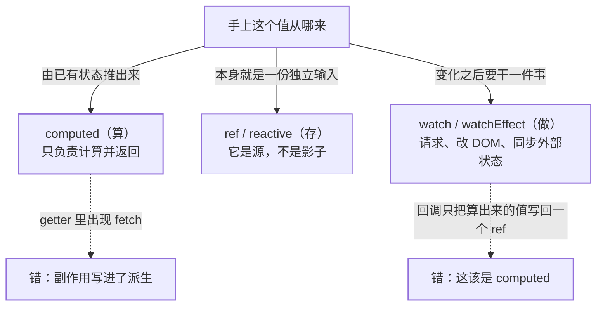
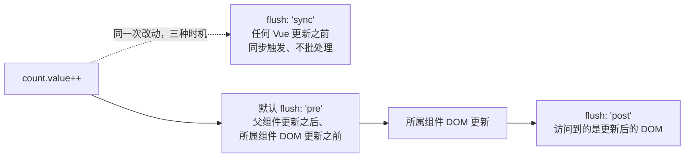

[响应式系统](/vue/basic/core/01-reactivity/)回答「改了数据谁会收到通知」，
[状态放在哪一层](/vue/intermediate/state/01-where-to-put-state/)回答「这份数据归谁所有、
谁能改」。这一篇问紧接其后的那一步：**手上这个值，是该存成一份状态，该由别的状态算
出来，还是该在它变化时跟着做一件事**。Vue 把三档分别交给 `ref` / `reactive`、
`computed`、`watch` / `watchEffect`，判据只有一条分界。官方中文侦听器页的开篇第一段
就是这条分界（原文）：

> 计算属性允许我们声明性地计算衍生值。然而在有些情况下，我们需要在状态变化时执行
> 一些「副作用」：例如更改 DOM，或是根据异步操作的结果去修改另一处的状态。

翻成可执行的话：**值是「读出来给人看」的就用 computed，事情是「变化之后要干」的才用
watch**；而 computed 的 getter 是纯函数这一条，官方写得比谁都硬（计算属性页「最佳
实践」原文）：

> 计算属性的 getter 应只做计算而没有任何其他的副作用……举例来说，**不要改变其他状态、
> 在 getter 中做异步请求或者更改 DOM**！

四道关卡各自算一笔账：该存还是该算、computed 的缓存到底落在哪、watch 的源与深浅、
回调什么时候跑以及要不要自己停。



## 关卡一：该存还是该算

官方对「存了一份派生值」的定性只有一句，但它同时给出了正解（计算属性页「避免直接修改
计算属性值」原文）：

> 从计算属性返回的值是派生状态。可以把它看作是一个「临时快照」，每当源状态发生变化
> 时，就会创建一个新的快照。更改快照是没有意义的……应该更新它所依赖的源状态以触发
> 新的计算。

「临时快照」这四个字是本关卡的全部因果：**快照不需要同步，源才需要同步**。一旦你把
`fullName` 也存成一份 `ref`，从此每次改 `firstName` 都得记得同时改它，漏一次就脏；
而 `computed` 把「什么时候该重算」交给依赖表，开发者不再负责同步。

反过来说，也确实有算不出来的东西。官方给的反例正好是这一条（计算属性页「计算属性缓存
vs 方法」）：

```js
// 官方原例：这个 computed 永远不会更新
const now = computed(() => Date.now());
// 因为 Date.now() 并不是一个响应式依赖
```

官方给的失效例子只有 `Date.now()` 这一条，但它代表的是一整类：任何不是响应式依赖的
量（`Math.random()`、外部库推进来的事件、闭包里的普通变量），computed 都追不到变化，
于是**第一次算完就再也不动**。这一句是把官方那条往外扩的同类外推——官方页面上只写了
`Date.now()`。这类值要么是源（老老实实存进 `ref`，由你自己决定何时更新），要么根本
不该出现在渲染路径上。官方把这条边界写成一句判据（深入响应式系统页，讨论「用响应式
副作用改一个 ref」时原文）：

> 使用一个响应式副作用来更改一个 ref 并不是最优解，事实上使用计算属性会更直观简洁：

官方同页紧接着给出了两组对照代码，本篇搬来当判据的两侧（第二段官方沿用同名变量
`A2`，这里改记为 `B2`，免得读成重复声明）：

```js
// 官方：能用 computed 声明的，就别用副作用去写
const A0 = ref(0);
const A1 = ref(1);
const A2 = ref();
watchEffect(() => {
  A2.value = A0.value + A1.value; // 追踪 A0、A1
});

// 官方改写：同样两个源，派生值交给 computed
const B2 = computed(() => A0.value + A1.value);
```

三档各自承担什么，用一张表钉住：

| 档位 | 回答的问题 | 谁让它变 | 一致性责任在谁 |
| --- | --- | --- | --- |
| `ref` / `reactive`（存） | 这是一份新输入 | 你自己的赋值 | 你——存了几份就要同步几份 |
| `computed`（算） | 由已有状态推出的值 | 依赖变化 | 依赖表——你只写推导规则 |
| `watch` / `watchEffect`（做） | 变化之后要干的事 | 依赖变化 | 你——但只对外部世界负责 |

**失效边界**：把派生值存成状态，坏在「忘了一处同步」；把没有依赖的东西硬算成派生值，
坏在算一次就冻住。判据只有一条：**能由现有状态纯推导出来的就算，推不出来的就存**。

## 关卡二：computed 的缓存到底落在哪一层

官方对缓存的定义只说清了「基于什么缓存」和「什么时候不重算」（原文）：

> **计算属性值会基于其响应式依赖被缓存**。一个计算属性仅会在其响应式依赖更新时才
> 重新计算。这意味着只要 `author.books` 不改变，无论多少次访问
> `publishedBooksMessage` 都会立即返回先前的计算结果，而不用重复执行 getter 函数。

对照的是方法调用：**方法在每次重新渲染时都会执行一次**（官方原句 *a method invocation
will always run the function whenever a re-render happens*）。官方给出的省钱理由是
派生链——一个很贵的 `list` 被多个计算属性依赖时，没有缓存就会「重复执行非常多次
`list` 的 getter」；反过来说，**确定不需要缓存时官方就直说「也可以使用方法调用」**，
缓存不是免费的。

机制侧官方只给了一句定位，本篇就只写这一句（深入响应式系统页原文）：

> 在内部，`computed` 会使用响应式副作用来管理失效与重新计算的过程。

也就是说 computed 与 `watchEffect` 是同一个 `track` / `trigger` 机器上的两种用法，
差别在于 computed 把「算出来的值」交出去，而副作用自己承担动作。**别把 computed
当成「自动 memo 一切」的黑盒**：它的收益完全取决于依赖表能不能认出「值变了」。
下面四种写法就是官方逐个点名过的失效处。

**① 依赖里混进非响应式的量。** 即上一关的 `Date.now()`：getter 追不到源，缓存永远
不失效，值也就再也不重算。

**② getter 里做副作用。** 官方的判词是「不要改变其他状态、在 getter 中做异步请求或者
更改 DOM」。理由就压在上一句缓存那条里：**官方保证的是「依赖没变时多次读只算一次」，
于是「究竟哪一次真的会算」由依赖表决定，而不是由你决定**。副作用写在 getter 里，等于
把「这件事什么时候发生」交给了运行时。

**③ 返回值每次都是新对象——3.4+ 的等值触发在这里失效。** 官方性能页
（Performance → Computed Stability）先把 3.4 起的行为讲清（该条与
[一次更新到底重做了什么](/vue/intermediate/rendering/01-update-cost/) 是同一条规则的
两面，那边算的是渲染账，这边算的是派生账）：计算属性只在返回值与上一个不同时才触发
订阅它的 effect。紧接着官方给出失效的那一半（原文口径）：如果 getter **每次都新建
对象**，新旧值「技术上永远不同」，于是每次都算「变了」；而要做深比较才能认出没变，
官方判定「这样的比较代价可能很高，大概率不值得」，所以框架不做。官方给的对策是手动
比较并**条件返回旧值**：

```js
// 官方性能页原例
const computedObj = computed((oldValue) => {
  const newValue = {
    isEven: count.value % 2 === 0,
  };
  if (oldValue && oldValue.isEven === newValue.isEven) {
    return oldValue; // 认出来没变，把旧引用还回去
  }

  return newValue;
});
```

官方在这段末尾补了一条容易被跳过的纪律：**必须先做完全部计算，再比较、再决定返回
哪一个**，否则某些依赖在那次运行里根本没被访问到，依赖表就漏了（原文 *you should
always perform the full computation before comparing and returning the old value,
so that the same dependencies can be collected on every run*）。

**④ 改计算属性返回的值。** 即关卡一那句「更改快照是没有意义的」——要改就改源。

顺带一条只在调试时才用得上、但面试常被追问的口径：`computed()` 的 getter 可以拿到
**上一个值**（官方「获取上一个值」一节，仅 3.4+ 支持）。两种 API 的参数位次不一样，
这是官方两处示例并列摆着的事实——组合式例子里它是第一个参数，选项式例子里它写在第二个
位置（第一位官方用 `_` 占位，表示那不是上一个值）：

```js
// 组合式：第一个参数就是上一个值
const alwaysSmall = computed((previous) => {
  if (count.value <= 3) return count.value;

  return previous; // 不满足条件时把上一个值还回去
});

// 选项式：官方案例第一位用 `_` 占位，上一个值写在第二位
export default {
  computed: {
    alwaysSmall(_, previous) {
      return this.count <= 3 ? this.count : previous;
    },
  },
};
```

最后是**可写 computed**。官方口径：计算属性默认只读，尝试赋值会收到运行时警告；确实
需要「写一个派生值」时，同时给 getter 和 setter 即可。官方两处示例（计算属性页的
`fullName` 拆回 `firstName` / `lastName`，API 页的 `plusOne` 写回 `count`）里 setter
做的都是**把外部输入写回源字段**；一旦 setter 里开始出现请求或跨状态同步，按官方对
getter 的同一条纪律，那更该是一个方法或一个 action（这一句是按官方纪律外推，官方未
直接给判词）。

**失效边界**：缓存跟着依赖表走，不跟着「我觉得这个值很贵」走。依赖不响应、每次新建
对象、getter 夹副作用，三种写法都会让「缓存」这个名字名不副实。

## 关卡三：watch 的源、深浅，以及它和 watchEffect 的分工

`watch` 第一个参数是「数据源」，官方列了四种形式：ref（含 computed ref）、getter
函数、响应式对象，或以上组成的数组。紧接着官方给了一条最容易被写错的注意（原文：
**注意，你不能直接侦听响应式对象的属性值**）：

```js
const obj = reactive({ count: 0 });

// 官方：错误，因为 watch() 得到的参数是一个 number
watch(obj.count, (count) => {
  console.log(`Count is: ${count}`);
});

// 官方：这里需要用一个返回该属性的 getter 函数
watch(
  () => obj.count,
  (count) => {
    console.log(`Count is: ${count}`);
  }
);
```

错因和 [响应式系统](/vue/basic/core/01-reactivity/) 里「解构丢响应」是同一条：
`obj.count` 取值的那一刻就脱离了代理，`watch` 收到的是个普通数字，没有任何东西可追。

深浅这一层官方写成四组对照，本篇按「谁会触发回调」重排：

| 写法 | 默认深浅 | 嵌套改动会触发吗 | `newValue` 与 `oldValue` |
| --- | --- | --- | --- |
| `watch(ref(基本值))` | 浅 | —— | 新旧不同 |
| `watch(reactive 对象)` | **隐含深层** | 会 | **同一个对象** |
| `watch(() => state.someObject)` | 浅 | 不会，只有整个对象被替换才触发 | 替换时才是两个对象 |
| `watch(() => state.someObject, cb, { deep: true })` | 强制深层 | 会 | 深层改动时仍是同一对象 |

两条要点是官方直接给的：*`watch` 默认是浅层的：被侦听的属性，仅在被赋新值时，才会
触发回调函数——而嵌套属性的变化不会触发*；以及那个反直觉的事实——深层改动时
`newValue` 与 `oldValue` 相等，**因为它们都指向同一个对象**（官方在两种写法下都重复
了这条提醒）。想要前值，就别走 deep，**侦听一个会产出不同值的源**：官方 API 页给的
正是这种写法——`watch(() => state.count, (count, prevCount) => { /* ... */ })`，
getter 返回基本值时新旧两个值都拿得到。

官方的警告紧随其后（原文）：**深度侦听需要遍历被侦听对象中的所有嵌套的属性，当用于
大型数据结构时，开销很大，因此请只在必要时才使用它**。3.5+ 起 `deep` 还可以传一个
数字，表示最多往下遍历几层。

`watch` 与 `watchEffect` 的分工官方写得非常干净（原文，两句连着引）：

> * `watch` 只追踪明确侦听的数据源。它不会追踪任何在回调中访问到的东西。另外，仅在
>   数据源确实改变时才会触发回调。……我们能更加精确地控制回调函数的触发时机。
> * `watchEffect`，则会在副作用发生期间追踪依赖。它会在同步执行过程中，自动追踪所有
>   能访问到的响应式属性。这更方便，而且代码往往更简洁，但有时其响应性依赖关系会不
>   那么明确。

由这两句能推出三条实战判据，全部有官方出处：

- **要看前值就用 `watch`。** `watchEffect` 只把当前值给你（它的回调没有旧值参数），
  而 `watch` 的回调签名是 `(newValue, oldValue, onCleanup)`。
- **依赖多到数不清时用 `watchEffect` 更省。** 官方原话：需要侦听一个嵌套数据结构里
  的几个属性时，`watchEffect()` 可能比深度侦听器更有效，**因为它只跟踪回调中用到的
  属性，而不是递归地跟踪所有属性**。
- **但 `watchEffect` 的追踪只在同步段成立。** 官方 tip 原话：*`watchEffect` 仅会在
  其**同步**执行期间，才追踪依赖。在使用异步回调时，只有在第一个 `await` 正常工作前
  访问到的属性才会被追踪*。这就是「回调里 await 之后读的那个 ref 改了却不重跑」的
  成因——要显式控制就别用 `watchEffect`。

两个时机开关：`watch` 默认懒执行（源变了才跑回调），官方给的例外写法是
`immediate: true`——想「先拉一次初始数据、之后源变了再拉」时用它，第一次调用时
`oldValue` 是 `undefined`；选项式里官方还补了首次执行的时点（*初始执行会在 `created`
钩子之前*，此时 `data`、`computed`、`methods` 都已处理完，可以放心取用）。3.4+ 起
多了 `once: true`：回调只触发一次，之后侦听器自动停止。

**失效边界**：`watch(obj.count)` 静默不工作、深层改动时误以为能拿到前值、
`watchEffect` 里 await 之后依赖失联——三条都不报错，只表现为「回调不跑」或「拿到的
前值其实和当前值是同一个对象」。

## 关卡四：时机、清理与生命周期——回调什么时候跑，要不要自己停

改一个响应式状态，可能同时触发组件更新和你自己写的侦听器。官方先给两条共同的规则：
DOM 更新不是同步应用的，Vue 会把改动缓存到「next tick」再统一更新，*无论你改了多少
处，每个组件只更新一次*；侦听器回调同样被批处理——官方举的例子是**同步往被侦听的
数组推一千项，不希望它触发一千次**。

在此之上，官方给了 `flush` 三档（默认 `pre`）。时序按官方措辞画成一条线：



三档各自的官方判词要连着读：默认档意味着「如果你尝试在侦听器回调里访问所属组件的
DOM，那么 DOM 将处于更新前的状态」；要在 Vue 更新后访问就写 `flush: 'post'`，
`watchEffect` 还有别名 `watchPostEffect()`；`flush: 'sync'` 则「会在 Vue 进行任何更新
之前触发」，官方给它的具体用途是**失效某个缓存**这类必须立刻做的事，同时给出警告
（原文）：*同步侦听器不会进行批处理，每当检测到响应式数据发生变化时就会触发。可以使用
它来监视简单的布尔值，但应避免在可能多次同步修改的数据源（如数组）上使用。* API 页
还补了一句同一方向的提醒：多属性同时改时，`sync` 会带来性能与数据一致性上的问题。

异步副作用必须配清理，这是官方给 `watch` 的第三个回调参数的用途。官方的情景是：
侦听 `id` 并发请求，但 `id` 在上一个请求返回前又变了——旧请求回来时带着已经过期的
id 执行回调。官方给的解法是注册清理函数（3.5+ 用 `onWatcherCleanup`）：

```js
import { watch, onWatcherCleanup } from 'vue';

watch(id, (newId) => {
  const controller = new AbortController();

  fetch(`/api/${newId}`, { signal: controller.signal }).then(() => {
    // 回调逻辑
  });

  onWatcherCleanup(() => {
    controller.abort(); // 作废这个已经过期的请求
  });
});
```

两条写法要分清楚，官方的限定就一句：`onWatcherCleanup` 仅 3.5+ 支持，且**必须在
`watchEffect` 效果函数或 `watch` 回调的同步执行期间调用**——不能在异步函数的 `await`
之后调它。而回调第三个参数 `onCleanup` 与侦听器实例相绑定，因此**不受这条同步限制**。
两者的语义都是「在下一次重新运行之前，清理上一次作废的副作用」。

生命周期这一条最容易漏，但官方的判据只押在**同步创建**这四个字上：在 `setup()` 或
`<script setup>` 里同步创建的侦听器会自动绑定宿主组件实例，组件卸载时自动停止；
一旦在异步回调里创建，它就不属于任何组件，必须手动停止。官方的例子：

```js
// 官方原例
watchEffect(() => {}); // 这个会随组件卸载自动停止

setTimeout(() => {
  watchEffect(() => {}); // 这个不会！
}, 100);
```

手动停止用返回值即可——`watch` / `watchEffect` 返回一个句柄，本身可以直接调用，也有
`stop()`，另外提供 `pause()` / `resume()` 临时挂起。选项式那边用
`this.$watch()`，它同样是「条件式建侦听器 / 提前取消」的官方出口。官方最后收了一句
口径：需要异步创建侦听器的情况很少，请尽可能同步创建；真需要等异步数据，就把侦听逻辑
写成条件式：

```js
const data = ref(null);

watchEffect(() => {
  if (data.value) {
    // 数据到位之后再做
  }
});
```

**失效边界**：`sync` 挂在数组上会被连续改动打穿；异步创建的侦听器随组件卸载继续活着
并泄漏；忘写清理则旧请求覆盖新结果——三者都不抛错，只在界面上表现为「数据慢一拍」或
「内存一直涨」。

## 一张表收尾：存 / 算 / 做 各管什么

| 问题 | 用什么 | 官方给的硬边界 |
| --- | --- | --- |
| 这是一份新输入吗 | `ref` / `reactive` | 存几份就要同步几份，漏一次就脏 |
| 由已有状态推出来 | `computed` | getter 必须纯；返回新对象则等值触发失效 |
| 需要「写一个派生值」 | 可写 `computed` | setter 该写回源字段，别塞副作用 |
| 变化后要请求 / 改 DOM | `watch` | 默认浅层、默认 `pre`、异步副作用要清理 |
| 依赖来自回调内部 | `watchEffect` | 只追踪同步段访问到的依赖 |
| 必须赶在 Vue 更新前 | `flush: 'sync'` | 无批处理，官方限定于简单值与失效缓存 |

## 面试答法

- **「computed 和 methods 的区别？」** 结果相同，账不同：computed 基于响应式依赖缓存，
  依赖不变就返回上一次结果；方法在每次重新渲染时都跑。官方给的取舍是「确定不需要缓存
  就用方法调用」，理由是多级派生时不缓存会重复算很多次。
- **「computed 的缓存什么时候不生效？」** 先分清一类失效、两类误用：失效是依赖里有
  非响应式的量（`Date.now()`），结果是永不重算；误用是把副作用写进 getter，以及每次
  返回新对象——3.4+ 的「值真变了才通知」对新建对象不成立，官方对策是用「上一个值」
  参数条件返回旧引用，且必须在完整计算之后再比较。
- **「什么时候用 watch 而不是 computed？」** 官方只认一件事：变化时要**执行副作用**
  （改 DOM、发请求、根据异步结果改别处状态）。只是派生一个值就该是 computed。
- **「watch 和 watchEffect 的区别？」** 依赖追踪方式：`watch` 只追显式源、只在源真
  变化时触发、拿得到前值；`watchEffect` 把追踪与副作用合成一段，同步执行期间访问到的
  都算依赖，简洁但依赖不明确，且 await 之后访问的不追。
- **「deep 的代价是什么？」** 官方警告原话是「需要遍历被侦听对象中的所有嵌套属性，
  用于大型数据结构时开销很大」；直接侦听响应式对象会隐含深层，但深层改动时新旧值是
  同一个对象；3.5+ 可以用数字限制遍历层数；侦听嵌套结构里的少数属性时 `watchEffect`
  可能更省。
- **「flush 三个值？」** `pre` 默认：父组件更新后、本组件 DOM 更新前，读自己的 DOM
  会读到旧 DOM；`post`：Vue 更新之后（别名 `watchPostEffect`）；`sync`：任何 Vue 更新
  之前同步触发、不批处理，官方只推荐用于简单布尔值和缓存失效。
- **「侦听器要自己销毁吗？」** 同步写在 `setup()` 里的不用，组件卸载自动停；异步回调
  里创建的不绑定组件，必须手动 `stop()`（或用选项式的 `$watch()` 返回句柄），否则
  内存泄漏。
- **「怎么防止旧请求覆盖新结果？」** 3.5+ 用 `onWatcherCleanup` 注册清理（必须同步
  调用），或取回调第三个参数 `onCleanup`（不受同步限制）；官方的例子是 `AbortController`。

## 要点备忘

- 一条分界：值是读出来的用 computed，事情是变化之后要做的用 watch
- 派生值是「临时快照」，改快照没意义，要改就改源
- `Date.now()` / `Math.random()` 不是响应式依赖，放进 computed 就冻在第一次
- getter 必须纯：不改其他状态、不发请求、不动 DOM（官方原话三条）
- 3.4+ 只在返回值真的变了才通知订阅者；每次新建对象会让这条失效
- 用「上一个值」条件返回旧引用时，先算完再比较，否则依赖收集会漏
- `watch(obj.count, ...)` 不工作，要写 `() => obj.count`（同「解构丢响应」一条因）
- 深层改动时 `newValue === oldValue`，因为它们指向同一个对象
- 深度侦听要遍历整棵树；能精确到 getter 就别整对象 deep
- `watchEffect` 只追踪同步段访问到的依赖，await 之后的不算
- 默认 `pre` 读不到更新后的 DOM；要读就 `post`；`sync` 不批处理，别挂数组
- 异步创建的侦听器不绑定组件，必须手动 stop，否则泄漏
- `immediate` 用于「先跑一次」，`once`（3.4+）用于「只跑一次」

## 延伸阅读

- [Vue 官方文档 · 计算属性](https://cn.vuejs.org/guide/essentials/computed.html)
  ——缓存 vs 方法、可写计算属性、获取上一个值、两条最佳实践
- [Vue 官方文档 · 侦听器](https://cn.vuejs.org/guide/essentials/watchers.html)
  ——数据源类型、深层 / 即时 / 一次性侦听器、`watch` vs `watchEffect`、副作用清理、
  回调触发时机、停止侦听器
- [Vue 官方文档 · 深入响应式系统](https://cn.vuejs.org/guide/extras/reactivity-in-depth.html)
  ——`track` / `trigger` 伪码、「computed 内部用响应式副作用管理失效与重算」
- [Vue 官方文档 · 性能 · Computed Stability](https://cn.vuejs.org/guide/best-practices/performance.html#computed-stability)
  ——3.4+ 的等值触发与新建对象失效、条件返回旧值的官方写法
- [Vue 官方 API · 响应式核心](https://cn.vuejs.org/api/reactivity-core.html)
  ——`computed()` / `watch()` / `watchEffect()` 的签名、选项默认值与句柄方法
- 站内互链：[响应式系统](/vue/basic/core/01-reactivity/)（`track` / `trigger` 与解构
  丢响应）、[Composition API 与逻辑复用](/vue/basic/core/03-composition-api/)
  （「能推导的状态别存储」那句出处的上下文）、
  [状态放在哪一层](/vue/intermediate/state/01-where-to-put-state/)（Pinia 的 getters
  本质就是 computed）、
  [一次更新到底重做了什么](/vue/intermediate/rendering/01-update-cost/)（同一条
  3.4+ 规则的渲染侧）、
  [重渲染传播与 memo 三件套](/react/basic/core/04-rerender-perf/)（React 侧没有内置的
  派生缓存原语，昂贵计算要显式 `useMemo`——那篇也写了新代码优先依赖编译器的口径，
  与 computed 的自动依赖追踪对照着看）
