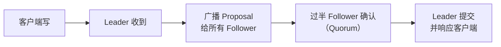

## ZooKeeper 是什么

ZooKeeper 是一个**分布式协调服务**：多个节点之间需要"统一认知"时（谁主谁备、
配置是什么、锁归谁），它提供一个高可用、强一致的小型存储来承载这些协调数据。
Kafka、HBase、Dubbo 等大量系统都用它做注册中心/选主/配置中心。

## 树形数据模型

ZK 的数据存成类似文件系统的树，每个节点叫 **znode**：

```text
/
├── /config
│   └── app.json
├── /services
│   ├── node-1
│   └── node-2
└── /locks
    └── order-lock
```

| 特性 | 说明 |
|---|---|
| 数据在内存 | 全量数据存内存，读快，写会落盘 |
| 每个 znode 存小数据 | 适合存配置、状态等小数据（默认上限 1MB） |
| 持久/临时节点 | 临时节点随会话断开自动删除 |
| 顺序节点 | 名字自动加单调递增序号 |
| 监听 Watch | 数据变化通知客户端 |

## ZAB 一致性协议

ZK 保证"所有节点看到的顺序一致"，靠 **ZAB（ZooKeeper Atomic Broadcast）**：



- **Leader**：唯一处理写请求的节点，先排序再广播。
- **Quorum 过半**：写入需超过半数的节点确认才提交，保证少数节点挂掉仍可用。
- **顺序一致性**：所有客户端看到的写顺序一致；每个写请求有全局唯一递增 zxid。

ZAB 与 Paxos/Raft 同属"共识门类"，思想一致：**Leader 排序 + 过半确认 + 日志
复制**。这也正是它在「分布式」图谱里作为 ZAB 落地代表的原因。

## 会话与 Watch 监听

- **会话（Session）**：客户端与 ZK 保持心跳连接，会话超时则其临时节点被清理。
- **Watch**：客户端对某 znode 注册监听，数据变化时收到一次性通知（触发后需
  重新注册）。这是 ZK 作为配置中心/注册中心的机制基础。

```text
服务启动 → 创建临时顺序节点 /services/node-xxx
         → 注册 Watch 监听 /services 的节点变化
         → 感知新增/下线节点
```

## 典型应用场景

| 场景 | 原理 |
|---|---|
| 配置管理 | 集中存配置，Watch 推送变化 |
| 命名服务 | 顺序节点生成全局唯一 ID |
| 分布式锁 | 临时顺序节点 + 最小序号者持锁 |
| 选主 | 临时节点竞争，谁先建成谁当主 |
| 注册中心 | 服务上下线通过临时节点感知 |

## 小结

- 树形 znode 数据模型 + 会话 + Watch 是 ZK 的能力底座。
- ZAB：Leader 排序 + 过半确认 + 日志复制，保证强一致。
- 临时/顺序节点是分布式锁、选主、注册中心的关键机制。

## 延伸阅读

- [ZooKeeper 官方文档](https://zookeeper.apache.org/doc/current/)