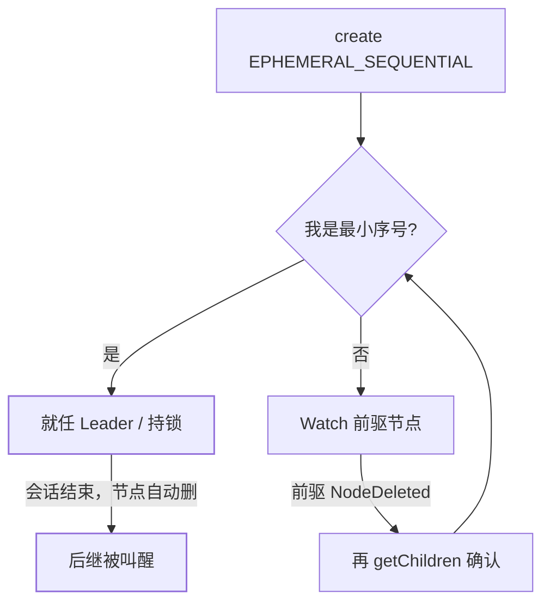

[核心机制](/zookeeper/basic/core/01-zookeeper-core/)把选主写成
「临时节点竞争，谁先建成谁当主」。这句话对 *概念* 够用，对 *实现*
不够——面试追问「一百个候选同时 Watch 会怎样」「锁释放为什么只叫醒
一个人」，答不出算法细节。本篇把选主和分布式锁收成同一套配方。

## 错误配方：抢 `/leader` 这一颗节点

```text
每个候选：create(/election/leader, EPHEMERAL)   # 不带顺序号
成功者 = Leader
失败者 Watch /election/leader，等它消失再抢
```

问题有三：

1. **羊群效应（herd）**：Leader 一挂，所有 Watcher 同时被叫醒，
   一起抢 create，ZK 写路径被打满，选主时间反而变长。
2. **无法排队**：失败者没有序号，只能「通知后再抢」，不能确定
   自己是第几顺位。
3. 仍要面对[半死会话](/zookeeper/basic/core/02-zk-deep-dive/)：
   服务端已删临时节点、客户端还以为自己是主。

临时节点防的是「进程死了锁不释放」，**不防羊群，也不防脑裂**。

## 标准配方：临时顺序节点 + Watch 前驱

所有候选在同一父节点下创建 **EPHEMERAL_SEQUENTIAL**：

```text
create(/election/n-, EPHEMERAL | SEQUENTIAL)
# 得到 /election/n-0000000003 这类名字
```

规则：

- **序号最小者 = Leader / 持锁人**；
- 其他人 **只 Watch 自己的前驱**（比自己小的最大序号），不 Watch
  父节点、不 Watch Leader 本身；
- 前驱消失（会话断 → 临时节点删）→ 再读一遍子节点，确认自己是否
  变成最小；是则上任，否则改 Watch 新的前驱。



代价对照：

| | 抢唯一节点 | 顺序节点 + Watch 前驱 |
|---|---|---|
| Leader 挂掉叫醒谁 | **所有**等待者 | **一个**后继 |
| ZK 写放大 | O(N) 次同时 create | 一次 create + 一次 delete 事件 |
| 公平性 | 谁重试快谁赢 | 按序号 FIFO |
| 实现复杂度 | 低 | 要处理「前驱已不在」的竞态 |

「前驱已不在」是必写分支：`exists(前驱, watch)` 返回 null 说明前驱
在你注册 Watch 前已经删了——必须回头重新 `getChildren`，不能干等
一个不会再来的事件。这和 Watcher **一次性 + 轻量通知** 是同一套
语义，只是用在了锁路径上。

## 选主 vs 锁：同一算法，业务语义不同

| | 选主（Leader Election） | 互斥锁 |
|---|---|---|
| 最小序号者 | 当主，开始工作 | 进入临界区 |
| 其余节点 | **继续活着**，当前驱，准备接任 | 阻塞直到获得锁 |
| 主动放弃 | 删自己的 znode 或关会话 | unlock = 删 znode |
| 典型库 | Curator `LeaderLatch` / `LeaderSelector` | Curator `InterProcessMutex` |

`LeaderLatch` 参与者一直占着自己的顺序节点（方便快速 failover）；
`LeaderSelector` 在 `takeLeadership()` 返回后会释放领导权——适合
「这轮工作干完就让贤」。不要混用它们的回调假设。

锁路径还有可重入：Curator 在 znode 数据里记下 owner + 计数，同一
会话再次 acquire 只加计数。跨进程可重入没有意义，不要把线程锁直觉
搬过来。

## 半死会话：算法解决不了，必须 fencing

配方保证「ZK 集群内部最多一个最小序号」。它**不保证**旧 Leader 的
进程已经停手——GC / 网络分区下，服务端判 session 过期并删节点，
后继上任，旧进程仍在写。这是[深挖篇](/zookeeper/basic/core/02-zk-deep-dive/)
的半死状态，也是[分布式锁选型](/distributed/intermediate/coordination/01-distributed-lock-compare/)
要求 fencing token 的原因。

工程落点：把 znode 的 **zxid 或顺序号**当作 epoch，写下游（DB、
对象存储、etcd）时带上；下游拒绝更小 epoch 的写。ZK 锁只解决
「谁有资格」，「旧资格失效后旧写打不进去」要另一层。

## 小结

- 选主 / 锁的正确实现是 **临时顺序节点 + 只 Watch 前驱**，不是抢
  一颗固定路径——后者会羊群效应。
- `exists(前驱)` 为空必须重读子节点，这是 Watcher 语义下的必写竞态。
- 算法给出集群内唯一最小者；跨进程正确性仍要 fencing，ZK 不代劳。

## 延伸阅读

- [ZooKeeper 官方 recipes：locks / leader election](https://zookeeper.apache.org/doc/current/recipes.html)
- [Curator 配方说明](https://curator.apache.org/docs/tech-note-02)
- [ZK Session 半死与 fencing](/zookeeper/basic/core/02-zk-deep-dive/)
